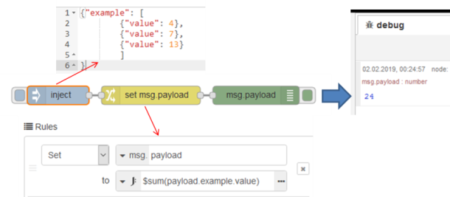

[<- На головну](../)  [Розділ](README.md)

## Приклад використання в застосунках Node-RED

JSONata використовується в багатьох вузлах Node-RED. 

До змінних полів змінної потоку  `msg` можна доступатися по назві полів, наприклад вказавши текст `payload` в цьому місці буде використано значення однойменної змінної. Через крапку можна доступатися до полів властивості. 

У JSONata можна використовувати різноманітні оператори та функції. На рис.10.2 показаний приклад використання в вузлі *change*, де використовується функція [`$sum()`](http://docs.jsonata.org/aggregation-functions#sum) яка підраховує значення `value` об'єкту `example`.  

рис.10.2.Приклад використання JSONata у вузлі change

