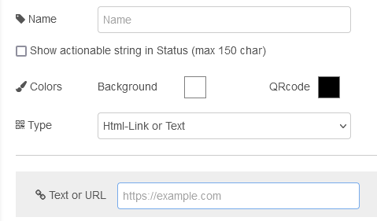
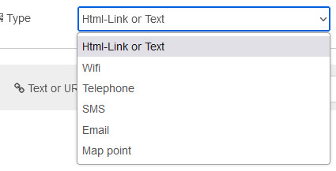

# [node-red-contrib-qrcode-generator](https://github.com/momentfree/node-red-contrib-qrcode-generator)


Створює QRCode з тексту дії. На основі модуля [node-qrcode](https://github.com/soldair/node-qrcode). Обробляє рядок для створення QRCode. Використовуйте редактор як помічник для створення текстового рядка дії (посилання, sms, wifi тощо) або опублікуйте власний рядок за допомогою властивості введення `msg.qrcodeinput`. [Тут](https://github.com/zxing/zxing/wiki/Barcode-Contents) є документація для створення власного тексту дії. Пам’ятайте, що QRCode є специфічним для деяких пристроїв, наприклад, конфігурація мережі Wi-Fi працює лише на Android або iOS 11+. Існує багато різних стандартів щодо тексту, що діє, помічник (конфігурація редактора) має на меті охопити деякі з найбільш використовуваних. Нарешті вузол повертає зображення формату DataUri у `msg.payload`. Ви можете відобразити результат DataUri на сторінці html з елементом img, використовуючи вузол template з mustache:

```html
<body>
  
</body>
```

або ви можете зв’язати вихід із [вузлом перегляду зображень](https://flows.nodered.org/node/node-red-contrib-image-tools) і отримати попередній перегляд на панелі робочої області Node-Red. 

Ви можете використовувати різні кольори, але майте на увазі, що колір фону має бути яскравішим за колір QR-коду.





### Вхід

Рядок `msg.qrcodeinput` [Custom](https://github.com/zxing/zxing/wiki/Barcode-Contents), він використовуватиметься замість конфігурації редактора. наприклад:

```
msg.qrcodeinput = 'mailto:someone@yoursite.com';
```

створює QR-код із текстом дії для надсилання електронної пошти на певну адресу.

### Вихід

`msg.payload` Зображення у форматі [DataURI](https://en.wikipedia.org/wiki/Data_URI_scheme).