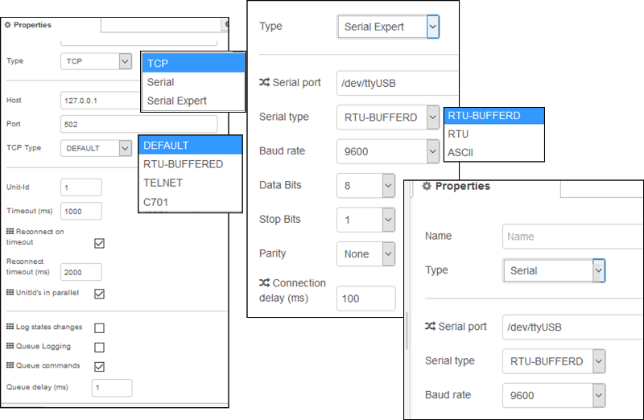

### The all in one Modbus TCP and Serial contribution package for Node-RED (node-red-contrib-modbus).

[Сайт](https://flows.nodered.org/node/node-red-contrib-modbus)

#### modbus-client

#### modbus-response

 Node to show response or response length from second output of Modbus Read/Write/Getter nodes in status.  Show-Max-Register is the border from where the node only shows, how many data are in response array.  That node is just to get some information and it is not necessary to work with Modbus Read/Write/Getter nodes.  If the Modbus Read/Write/Getter sends data very quick, don't use this node to much, please. 

#### modbus-read

  **If you have more than 10 nodes on one communication configuration, use  the Modbus-Flex-Getter or think about multiple connections to your  Modbus device, please! You can do polling with the Modbus-Getter and  Modbus-Flex-Getter, too by using an injecting node with an interval.**  Modbus TCP/Serial read node.  Connects to a Modbus TCP or serial to read registers/coils values with a given polling rate.   Function codes currently supported include:  FC 1: Read Coil Status FC 2: Read Input Status  FC 3: Read Holding Registers FC 4: Read Input Registers    Choose a function code (FC) from the dropdown menu, select the  coil/input/register start address (0:65535), and the quantity of  coils/inputs/registers to be read from the start address.  Unit-Id (0..255 tcp | 1..247 serial) - leave empty, otherwise it overrides the default Unit-ID of client config  Setup a polling rate (greater than zero) and the time unit. Choose or edit the Modbus connection configuration.   Output 1: data Array (PDU), modbus response Buffer, input message  Output 2: modbus response Buffer, data Array (PDU), input message 

#### modbus-getter

**Якщо у вас є більше 10 вузлів в одній конфігурації зв'язку, використовуйте Modbus-Flex-Getter або подумайте про кілька підключень до свого пристрою Modbus! **

Modbus TCP/Serial вузол із функцією зчитування за ініціювання входу. Підключається до Modbus TCP або serial для зчитування  coils/inputs/registers зі швидкістю вхідного повідомлення. На даний момент підтримуються коди функцій: 

- FC 1: Read Coil Status 
- FC 2: Read Input Status  
- FC 3: Read Holding Registers 
- FC 4: Read Input Registers    

Виберіть зі спадного меню код функції (FC), виберіть адресу (0: 65535) та кількість coil/input/register, які слід прочитати зі стартової адреси. Виберіть або відредагуйте конфігурацію з'єднання Modbus. Unit-Id (0..255 tcp | 1..247 serial) - залиште порожнім, інакше він перекриває типовий ідентифікатор Unit-налаштування клієнтського конфігурації. 

Вихід 1: масив даних (PDU), буфер відповіді модуля, вхідне повідомлення 

вихід 2: modbus Буфер відповідей, масив даних (PDU), вхідне повідомлення

#### modbus-flex-getter

  Modbus TCP flexible input triggered read node with connection input parameters.   Connects to a Modbus TCP or serial to read coils/inputs/registers at the rate of the incoming msg.   Function codes (1:4) currently supported include:  FC 1: Read Coil Status FC 2: Read Input Status FC 3: Read Holding Registers FC 4: Read Input Registers     **Input parameter for connecting Modbus**   unitid (0..255 tcp | 1..247 serial) - overrides default Unit-ID fc (1..4) start address (0:65535) quantity (1:65535) of coils/inputs/registers to be read from the start address    Output 1: data Array (PDU), modbus response Buffer, input message  Output 2: modbus response Buffer, data Array (PDU), input message Function node code example for single input: ` msg.payload = { value: msg.payload, 'fc': 1, 'unitid': 1, 'address': 0 , 'quantity': 1 } return msg `  Function node code example for multiple inputs: ` msg.payload = { value: msg.payload, 'fc': 3, 'unitid': 1, 'address': 0 , 'quantity': 10 } return msg ` 

#### modbus-write

  **If you have more than 10 nodes on one communication configuration, use  the Modbus-Flex-Writer or think about multiple connections to your  Modbus device, please!**  Modbus TCP/Serial node triggered with **msg.payload** to write.  Connects to a Modbus TCP or serial to write coils/registers at each incoming msg.   Function codes currently supported include:  FC 5: Force Single Coil FC 6: Preset Single Register FC 15: Force Multiple Coils FC 16: Preset Multiple Registers    Choose a function code (FC) from the dropdown menu, select the  coil/register start address (0:65535) and the quantity to write. Choose  or edit the Modbus TCP/serial server configuration to specify the server to connect to.  Unit-Id (0..255 tcp | 1..247 serial) - leave empty, otherwise it overrides the default Unit-ID of client config  For FC 5, **msg.payload** must be a value of 1 or 0 or true or false. For FC 15,  **msg.payload** must be an array[] of comma separated values true or false each. For FC 6, **msg.payload** must be a single value between 0:65535. For FC 16, **msg.payload** must be an array[] of comma separated values between 0:65535 each.   Output 1: all given data, modbus response Buffer, input message  Output 2: modbus response Buffer, all given data, input message 

#### modbus-flex-write

  Modbus TCP flexible input triggered write node with connection input parameters.   Connects to a Modbus TCP or serial to write coils/registers on each incoming msg.   Function codes currently supported include:  FC 5: Force Single Coil FC 6: Preset Single Register FC 15: Force Multiple Coils FC 16: Preset Multiple Registers     **Input parameter for connecting Modbus**   unitid (0..255 tcp | 1..247 serial) - overrides default Unit-ID fc (5|6|15|16) start address (0:65535) quantity (1:65535) of coils/inputs/registers to be written from the start address    For FC 5, **msg.payload** must be a value of 1 or 0 or true or false. For FC 6, **msg.payload** must be a single value between 0:65535. For FC 16, **msg.payload** must be an array[] of comma separated values between 0:65535 each.   Output 1: all given data, modbus response Buffer, input message  Output 2: modbus response Buffer, all given data, input message Function node code example for single write:  ` msg.payload = { value: msg.payload, 'fc': 5, 'unitid': 1, 'address': 0 , 'quantity': 1 } return msg `  Function node code example for multiple write: ` msg.payload = { value: msg.payload, 'fc': 15, 'unitid': 1, 'address': 0 , 'quantity': 10 } return msg ` 

#### modbus-server

 Node to provide a Modbus TCP server based on node-modbus (jsmodbus) for testing.  On injecting the server sends the Buffers to the separate outputs  You can use the Modbus write nodes (FC) to write data to the server buffers.  You can use the Modbus read nodes (FC) to read data from the server buffers. Output 1: holding Buffer, type, msg Output 2: coils Buffer, type, msg Output 3: input Buffer, type, msg  Output 4: discrete Buffer, type, msg 
  Input: On injecting a special payload, you can write directly to any  register. This should only be used if you want to simulate a Modbus  client.  ` msg.payload = { 'value': msg.payload, 'register': 'holding', 'address': 1 , 'disableMsgOutput' : 0 }; return msg;  `  The value could also be a list of UInt8 numbers and they will be written to the buffer.  Valid registers are:  holding coils input discrete  Set disableMsgOutput if you want to disable the Server outputs when injecting. 

#### modbus-flex-server

 Node to provide a flexible Modbus TCP server based on modbus-serial for testing.  The modbus-serial package allows to configure/inject code to handle  modbus requests. With that you can build you personal Modbus server. The function frame is fix - just the body of functions is flexible.  On injecting the server sends the Buffers to the separate outputs  You can use the Modbus write nodes (FC) to write data to the server buffers.  You can use the Modbus read nodes (FC) to read data from the server buffers. Output 1: holding Buffer, type, msg Output 2: coils Buffer, type, msg Output 3: input Buffer, type, msg  Output 4: discrete inputs Buffer, type, msg 
  Input: On injecting a special payload, you can write directly to any  register. This should only be used if you want to simulate a Modbus  client.  ` msg.payload = { 'value': msg.payload, 'register': 'holding', 'address': 1 , 'disableMsgOutput' : 0 }; return msg;  `  The value could also be a list of UInt8 numbers and they will be written to the buffer.  Valid registers are:  holding coils input discrete  Set disableMsgOutput if you want to disable the Flex Server outputs when injecting. 

#### modbus-queue-info

  **A queue is set per unit - setup the unit-id to get the right information.**   Modbus TCP/Serial queue information node. Unit-Id (0..255 tcp | 1..247 serial) Use inject of `msg.resetQueue = true` to reset the queue. Reset on high level to connect with the catch node `        [{"id":"430f76bf.9de2d8","type":"function","z":"b245d3e4.b52de","name":"reset on High",        "func":"if(\"high level reached\" === msg.state) {\n    msg.payload.resetQueue = true;\n    return msg;\n}\n",        "outputs":1,"noerr":0,"x":410,"y":140,"wires":[["64cca59a.dc295c"]]}]      ` Reset on high high level to connect with the catch node  `            [{"id":"fc74491.2ddc9b8","type":"function","z":"b245d3e4.b52de","name":"reset on HighHigh",            "func":"if(\"high high level reached\" === msg.state) {\n    msg.payload.resetQueue = true;\n    return msg;\n}\n",            "outputs":1,"noerr":0,"x":430,"y":180,"wires":[["64cca59a.dc295c"]]}]          `   An update of all unit queues can be watched by checking the option. Use just a single queue info per client if you activate that option.  "Error on high level" with that option the node sends an error if high level is reached and on high high level. With reaching the high level there comes a warning and with the high high an error for work with the catch node Output: all queue information - use complete msg with debug 

#### modbus-flex-connector

  Modbus Flex Connector is a node for flexible input triggers to reconnect with new connection parameters.    `msg.payload.connectorType = 'TCP' || 'SERIAL'`   [TCP options](http://127.0.0.1:1880/#)   msg.payload.tcpHost || node.tcpHost msg.payload.tcpPort || node.tcpPort  msg.payload.tcpType || node.tcpType msg.payload.unitId || node.unit_id  msg.payload.commandDelay || node.commandDelay msg.payload.clientTimeout || node.clientTimeout  msg.payload.reconnectTimeout| || node.reconnectTimeout    [SERIAL options](http://127.0.0.1:1880/#)   msg.payload.serialPort || node.serialPort msg.payload.serialBaudrate || node.serialBaudrate  msg.payload.serialDatabits || node.serialDatabits msg.payload.serialStopbits || node.serialStopbits  msg.payload.serialParity || node.serialParity msg.payload.serialType || node.serialType  msg.payload.serialConnectionDelay || node.serialConnectionDelay msg.payload.unitId || node.unit_id  msg.payload.commandDelay || node.commandDelay msg.payload.clientTimeout || node.clientTimeout  msg.payload.reconnectTimeout || node.reconnectTimeout    Function node code examples for TCP: ` msg.payload = { 'connectorType': 'TCP', 'tcpHost': '127.0.0.1', 'unitId': 2 } return msg ` ` msg.payload = { 'connectorType': 'TCP', 'tcpHost': '127.0.0.1', 'tcpPort': '10502' 'unitId': 2 } return msg `  Function node code example for SERIAL: ` msg.payload = { 'connectorType': 'SERIAL', 'serialPort': '/dev/USB02', 'serialBaudrate': '9600' 'unitId': 2 } return msg  ` 

# modbus-response-filter

  Modbus Response Filter   The Response Filter is to work with an IO-File to filter values out of an IO-Payload by name.  Deploy first to use the lookup button! You need a working IO-File-Config for the lookup. 