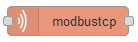
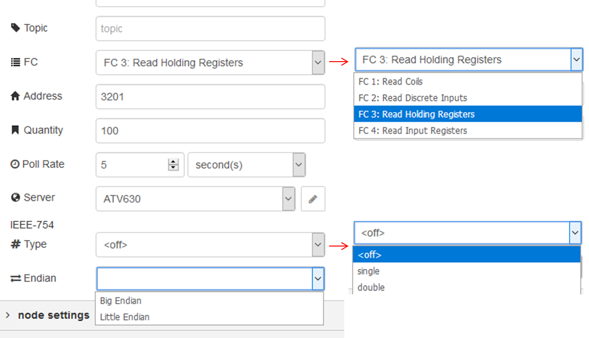

[<- На головну](../)  [Розділ](README.md)

## Modbus-tcp Read (читання об’єктів)

 Підключається до Modbus TCP server для зчитування змінних з вказаною періодичністю (рис.6.2). 

Підтримуються наступні Modbus функції:

- FC 1: Read Coils
- FC 2: Read Discrete Inputs
- FC 3: Read Holding Registers
- FC 4: Read Input Registers

Вибирається необхідна функція (FC), стартова адреса зміщення coil/input/register (0:65535) кількість, вказується періодичність зчитування (необхідно ставити більше нуля!). 



рис.6.2. Налаштування вузлу Modbus-tcp Read

**В полі** **IEEE-754** можна вибрати формат IEEE 754 Single або Double. Також вибирається порядок регістрів в них - Big або Little endian.

Можна використовувати на вході один або більше значень payload для ініціювання зчитування окрім заданого періодичністю. Наприклад, можна використати вузол inject для вприскування  JSON payload подібного до наступного: ``

```json
  {
    "name": "HoldingsDblBig",
    "topic": "Topic1",
    "address": 0,
    "quantity": 4,
    "dataType": "FC3",
    "interval": 3000, // in ms
    "ieeeBE": true,
    "ieeeType": "double"
  }   
```

Вихід **msg** вміщує **msg.payload** з масивом прочитаних coils/inputs/registers. **msg.settings** також вміщує додаткову інформацію про запит, що був використаний для генерування зчитування, включаючи **msg.settings.name**. 