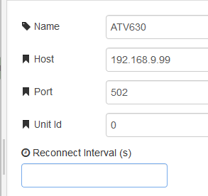

[<- На головну](../)  [Розділ](README.md)

## Modbus-tcp Server (Конфігурування серверу)

Конфігураційний вузол MODBUS-TCP Server використовується для вказівки серверу, з якого буде відбуватися читання/запис. Усі поля відповідають згідно призначенню протоколу (рис.6.1). Reconnect Interval дозволяє MODBUSTCP підключенням автоматично перепідключатися по TCP після вказаного інтервалу. Якщо автоматичне підключення не вимагається – це поле треба залишити порожнім. 

рис.6.1. Налаштування Modbus-tcp Server