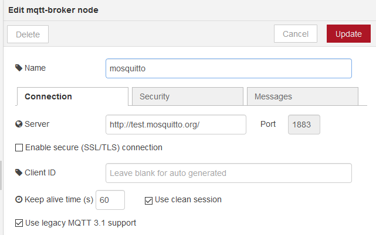
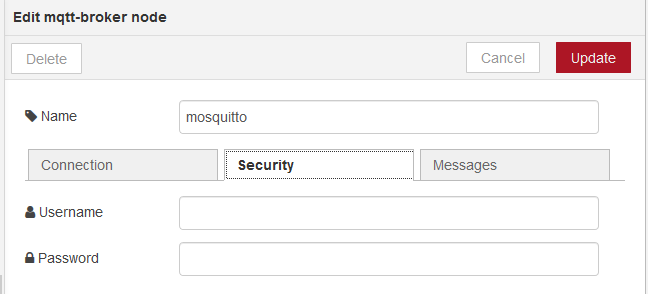
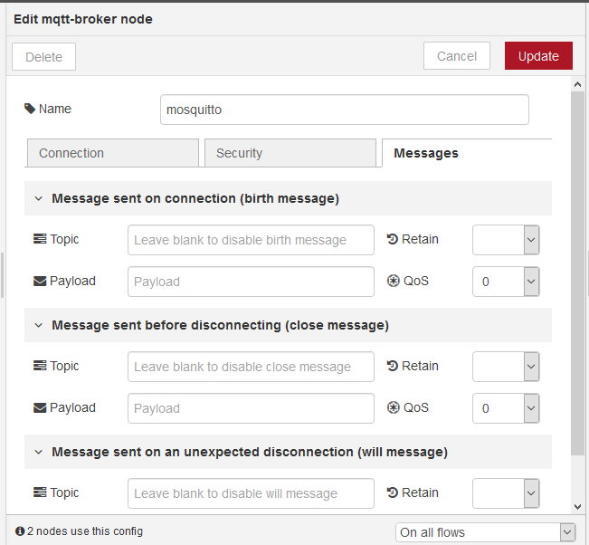

## Mqtt-broker (конфігурування)

Для налаштування брокерів MQTT є конфігураційні вузли Mqtt-broker. В налаштуваннях вузлів вказуються типові налаштування брокеру (рис.7.3-7.5).

рис.7.3. Конфігурування з’єднання з брокером MQTT 

рис.7.4. Конфігурування параметрів безпеки з’єднання з брокером MQTT

рис.7.5. Конфігурування повідомлень для з’єднання з брокером MQTT