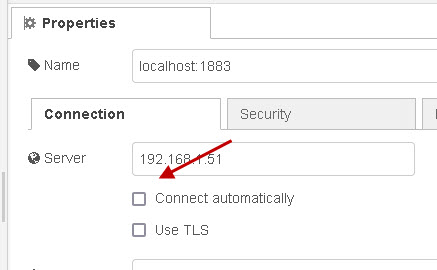
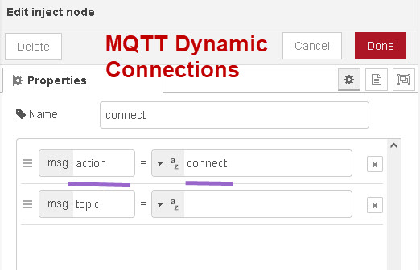
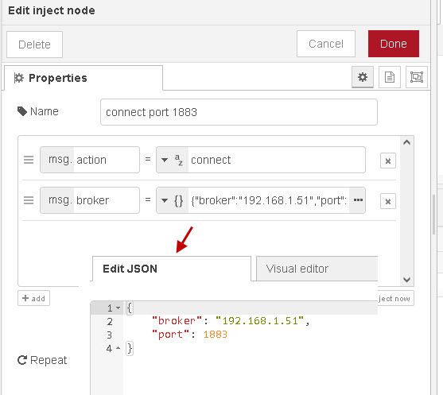
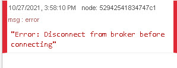
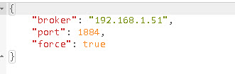
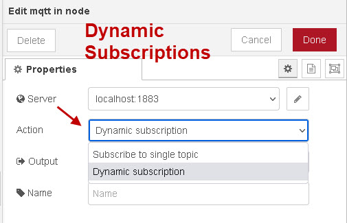
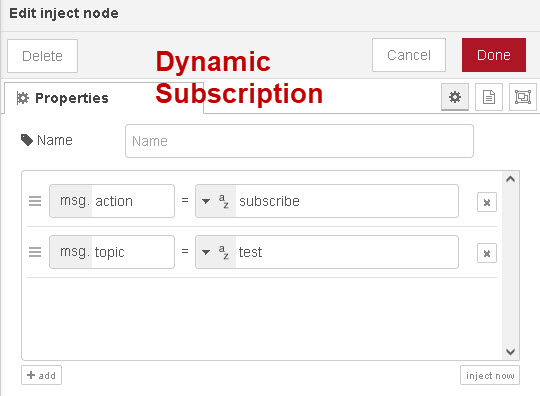
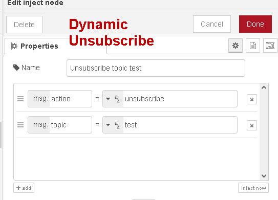

[<- На головну](../)  [Розділ](README.md)

## Додаткові можливості починаючи з версії 2.1

### Динамічні з'єднання   

Оригінальна версія статті взята з [Стаття MQTT Dynamic Connections](https://stevesnoderedguide.com/mqtt-dynamic-connections)

До node-red версії 2.1 вузол MQTT **автоматично підключався**, коли потік був запущений, і було неможливо від’єднатися від брокера. Крім того, вузол підписки було налаштовано з темою, і було неможливо підписатися на додаткові теми чи скасувати підписку на теми після початку потоку. Версія версії 2.1 node-red тепер підтримує

- динамічні зв'язки
- динамічні налаштування брокера
- динамічні підписки

надаючи вам можливість програмно керувати з’єднанням і підписками.

#### Налаштування динамічних підключень

У діалоговому вікні підключення до сервера тепер є прапорець для динамічних підключень (connect automatically).

Прапорець `connect automatically` зазвичай увімкнено за замовчуванням. у цьому випадку вузол функціонує так само, як і раніше, і підключатиметься автоматично, і ви не зможете відключитися. Вимкнувши його, ви встановлюєте вузол для **динамічних з’єднань.** Якщо вузол MQTT налаштовано для **динамічного з’єднання**, вам потрібно буде підключатися та від’єднуватися вручну. Крім того, ви також можете змінити конфігурацію брокера без редагування вузла. Фактичні відомості про брокера можна динамічно передавати до вузлів `MQTT-IN` і `MQTT-OUT` і перезаписуватиме параметри, налаштовані в конфігурації вузла. Ви можете встановити **broker, port, username, password**

#### Як це працює

Пам’ятайте, що вузли `MQTT-IN` (підписка) і `MQTT-Out` (публікація) можуть спільно використовувати підключення до брокера. Якщо у вас є вузол підписки MQTT і вузол публікації в потоці, і ви налаштували їх на використання того самого брокера та використання динамічних з’єднань, тоді надсилання сигналу з’єднання будь-якому з вузлів призведе до того, що **обидва вузли** з’єднаються так саме, так як спільно використовують одне брокерське підключення. Керуюче повідомлення підключення/відключення передається у вузол за допомогою властивості `action` (`msg.action`). На знімку екрана нижче показано вузол `inject`, налаштований для надсилання повідомлення підключення

Ви повинні помітити, що корисне `payload` не надсилається, але якщо ви надсилаєте  `payload`, воно не надсилається. 

Якщо динамічні з’єднання ввімкнено, параметри сервера вузла також можна змінити шляхом введення повідомлення з новими налаштуваннями. Налаштування брокера надсилаються як об’єкт JavaScript у властивості **msg.broker**. На знімку екрана нижче показано вузол `inject`, налаштований на надсилання повідомлення про з’єднання, а також зміну налаштувань посередника:

**Примітка**: зверніть увагу, що якщо ви вже підключені, вам спочатку потрібно від’єднатися, інакше ви отримаєте повідомлення про помилку.

Однак ви можете примусово від’єднатися та повторно підключитися з новими налаштуваннями за допомогою примусового налаштування.

#### Динамічні підписки

Зі старим вузлом **MQTT-IN** підписка була автоматичною, і ви не могли скасувати підписку. Тему було встановлено як частину конфігурації вузла. Вузол публікації завжди дозволяв надсилати тему у вузол із попереднього вузла. Тепер ви можете зробити це за допомогою вузла підписки, увімкнувши **динамічні підписки**.

Для динамічної підписки вам потрібно встановити **властивість action ** рівною  `subscribe` та **властивість topic ** рівною темі, на яку ви хочете підписатися.

Щоб скасувати підписку, скористайтеся **action unsubscribe** та вкажіть тему, від якої ви хочете скасувати підписку:

#### Резюме

Вузли MQTT тепер дозволяють динамічні підключення, динамічні налаштування брокера та динамічні підписки роблять їх набагато гнучкішими, ніж у попередніх версіях.

#### Додаткові (не зі статті)

Додаткові властивості віхдного msg:

- `action` (string)  - назва дії, яку повинен виконати вузол. Доступні дії:
  - `connect`,
  - `disconnect`
- `broker` (broker) -  Для дії `"connect"` ця властивість може перевизначати будь-які індивідуальні параметри конфігурації брокера, зокрема:
  - `broker` 
  - `port`
  - `url` -  замінює broker/port, щоб надати повну URL-адресу з’єднання
  - `username` 
  - `password`         

Якщо цю властивість встановлено, а брокер уже підключено, буде зареєстровано помилку, якщо для нього не встановлено властивість `force` — у цьому випадку він від’єднається від брокера, застосує нові налаштування та під’єднається знову.         

### MQTTv5 

#### MQTT-In

- `responseTopic` (string) - the MQTT response topic for the message
- `correlationData` (Buffer) - the correlation data for the message
- `contentType` (string) - the content-type of the payload
- `userProperties` (object) - any user properties of the message
- `messageExpiryInterval` (number) - the expiry time, in seconds, of the message
- `topicAlias` (number) - the MQTT topic alias to use

#### MQTT-Out

- `responseTopic` (string) - the MQTT response topic for the message
- `correlationData` (Buffer) - the correlation data for the message
- `contentType` (string) - the content-type of the payload
- `userProperties` (object) - any user properties of the message
- `messageExpiryInterval` (number) - the expiry time, in seconds, of the message
- `topicAlias` (number) - the MQTT topic alias to use