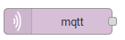
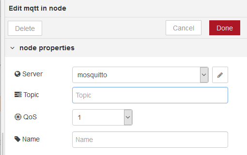

[<- На головну](../)  [Розділ](README.md)

## Mqtt in (вхідні повідомлення з MQTT)

Підключається до брокера MQTT та підписується на повідомлення з зазначеної теми (рис.7.1).

рис.7.1. Налаштування вузлу Mqtt in

На виході вузла повідомлення містить наступні властивості: 

- `payload (string | buffer)` – корисне навантаження у     вигляді рядку або бінарного буферу
- `topic (string)` - MQTT topic, використовується «/»     як ієрархічний розділювач
- `qos (number)` – 0..2 (0, fire and forget - 1, at     least once - 2, once and once only)  
- `retain (Boolean)` – показує, що повідомлення було збережене і може бути старим 

Тема підписки може включати підстановки MQTT, «+» для одного рівня, «#» для декількох рівнів. Цей вузол вимагає встановлення зв'язку з брокером MQTT, який налаштовується, натиснувши піктограму олівця.

За необхідності кілька вузлів MQTT (у вхідному або вихідному режимі) можуть мати доступ до одного і того ж брокеру.

[Додаткові можливості з в.2.1](mqttdynamic.md)