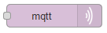
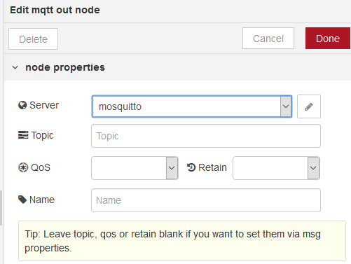

## Mqtt out (вихідні повідомлення до MQTT)

Підключається до брокера MQTT та публікує повідомлення (рис.7.2).

В якості вхідного значення приймає наступні властивості повідомлень:

- payload (string | buffer) - більшість     користувачів віддають перевагу простим текстовим корисним навантаженням,     але також можуть бути опубліковані двійкові буфери.
- topic (string) - MQTT тема (topic) для публікації 
- qos (number) – 0..2 (0, fire and forget - 1, at     least once - 2, once and once only)
- retain (boolean) – виставити     в true     для збереження повідомлення на брокері

 

рис.7.2. Налаштування вузлу Mqtt out

`msg.payload` використовується як корисне навантаження опублікованого повідомлення. Якщо він містить об'єкт, його буде перетворено в рядок JSON, перш ніж буде надіслано. Якщо він містить бінарний буфер, повідомлення буде опубліковано як-є.

Використовувана тема може бути налаштована в вузлі або, якщо залишена порожньою, може бути встановлена за допомогою `msg.topic`.

Аналогічно, QoS та значення опції `retain` можуть бути налаштовані в конфігурації вузлу або, якщо вони залишаються порожніми, встановлюються відповідно `msg.qos` та `msg.retain` відповідно. Щоб очистити раніше збережену тему від брокера, надішліть порожнє повідомлення на цю тему за допомогою встановленого прапора.

Цей вузол вимагає встановлення зв'язку з брокером MQTT. Це налаштовується, натисканням піктограми олівця. За необхідності кілька вузлів MQTT (у вхідному або вихідному режимі) можуть мати доступ до одного і того ж брокеру.