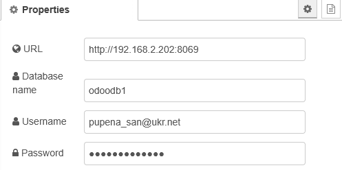
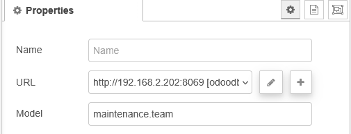
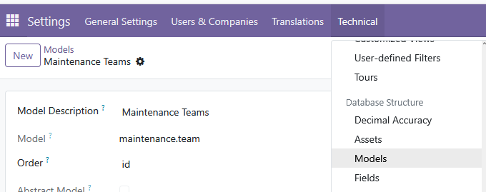
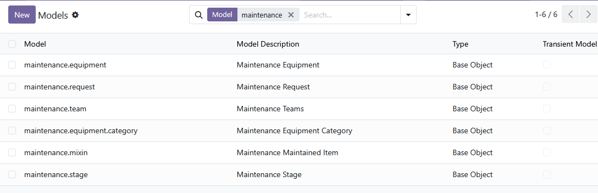
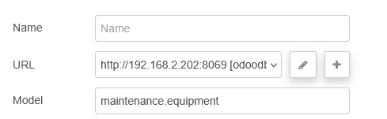
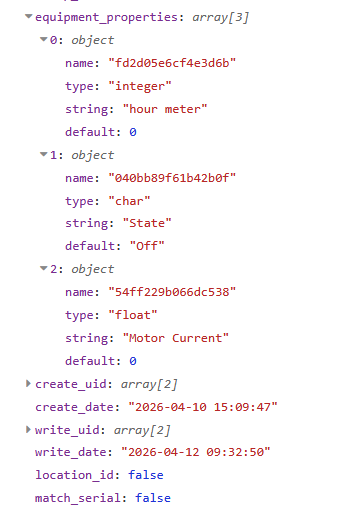

[<- На головну](../)

# Інтеграція з Odoo

Частина API моделей  (Models API) легко доступна через [XML-RPC](https://github.com/asu-in-ua/atpv/blob/main/distribap/xmlrpc/teor.md) і може використовуватися з різних мов програмування. Опис API доступний в народному посібнику [за посиланням](https://github.com/asu-in-ua/atpv/blob/main/odoo/externalapi/teor.md)

## node-red-contrib-odoo-xmlrpc-2021

Бібліотека доступна [за посиланням](https://github.com/dafi87/node-red-contrib-odoo-xmlrpc-2021)

### odoo-xmlrpc-config



### odoo-xmlrpc-search

Викликає метод `search` в Odoo для вказаної моделі. Фільтри можна передати у вигляді масиву в атрибуті `filters` вхідного повідомлення. Параметри `offset` та `limit` можна керувати через відповідні атрибути повідомлення `offset` і `limit`.



Моделі можна подивитися в odoo в режимі активності `Developer mode`



ось наприклад для `maintenance` доступні такі моделі: 



Якщо на вхід не передавати поля фільтрації, то поверне усі значення моделі. Наприклад, якщо `model=maintenance.equipment` то поверне масив ідентифікаторів Equipment.

Якщо на вхід подати `msg.filters = [[["name","=","Motor1"]]]` то поверне значення масив з одним значенням `ID` в якого ім'я буде "Motor1".    


### odoo-xmlrpc-read

Викликає метод `read` в Odoo для вказаної моделі. Ідентифікатори записів передаються у вигляді масиву з `msg.payload`.



Якщо на вхід не подати ідентифікатори, то результат - порожній масив.

Наприклад передача на `msg.payload=[9]` - видасть масив, в якому буде значення Equipmnet з ID=9.


### odoo-xmlrpc-search-read

### odoo-xmlrpc-create


### odoo-xmlrpc-exec

### odoo-xmlrpc-unlink

### odoo-xmlrpc-update



Щоб змінити значення властивостей, у `msg.payload` треба записати

```
[
    [
        9
    ],
    {
        "equipment_properties": [
            {
                "name": "54ff229b066dc538",
                "value": 15.5
            },
            {
                "name": "040bb89f61b42b0f",
                "value": "on"
            },
            {
                "name": "fd2d05e6cf4e3d6b",
                "value": 11
            }
        ]
    }
]
```

