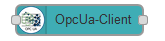
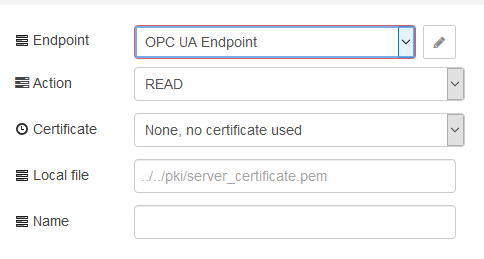
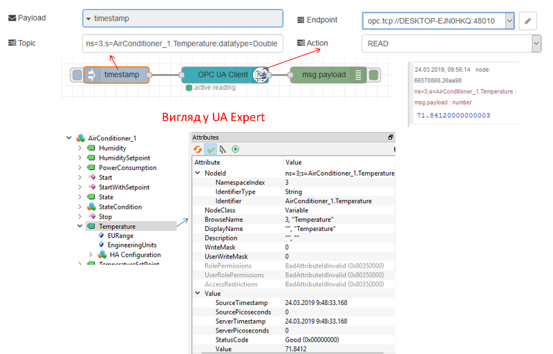
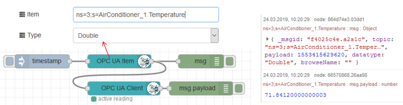
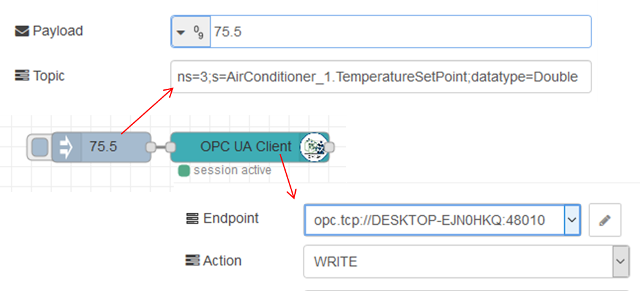
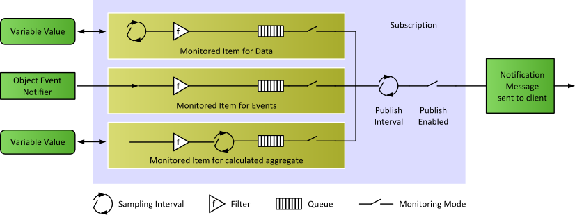
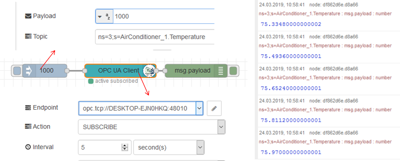
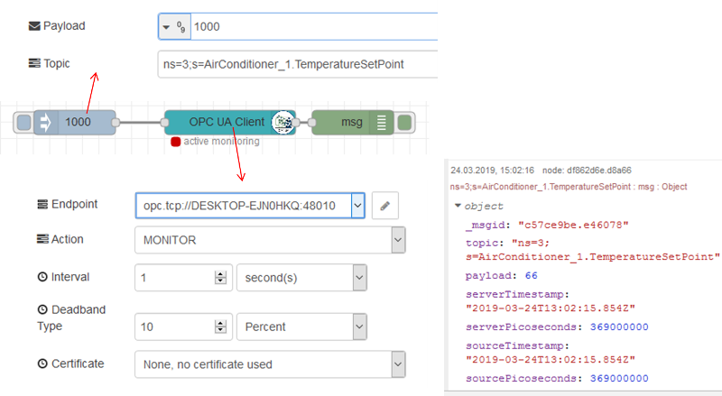
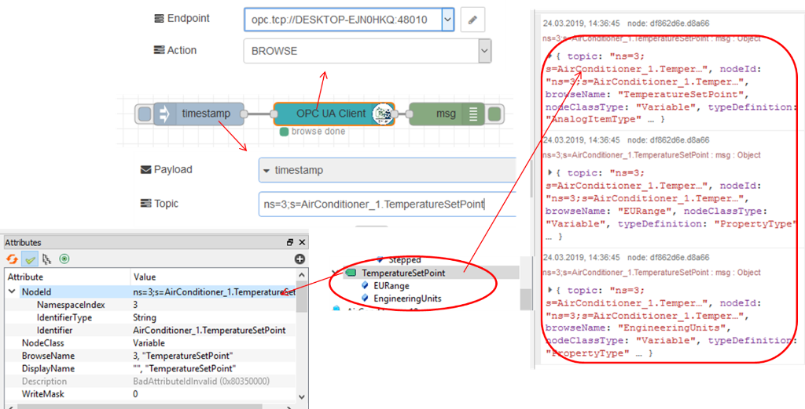

[<- На головну](../)  [Розділ](README.md)

## OpcUa-Client

Призначений для взаємодії з Server, з’єднаним з вказаною кінцевою точкою (рис.16.3).

рис.16.3. Налаштування OpcUa-Client 

Дії:

- READ

- WRITE
- BROWSE
- SUBSCRIBE
- UNSUBSCRIBE
- EVENTS
- INFO
- MONITOR
- READ MULTIPLE
- WRITE MULTIPLE

Параметри сертифіката серверу:

- None
- Local file 

Сертифікат не потрібен, якщо security в значенні NONE. Клієнт спробує завантажити серверний сертифікат з кінцевої точки, якщо сервер може його надати (скопіювати сертифікат сервера з папки pki). Для використання сертифіката сервера (файл розширення .pem) може бути використаний локальний файл із відносним шляхом та ім'ям сертифікату. Користувач може вручну копіювати сертифікат сервера.

### Read 

Для запиту читання (READ) необхідно ввести адресу NodeId в Topic повідомлення, що входить в вузол OPC UA Client. Крім того, треба вписати тип даних, що зчитується. На рис.16.4. наведений приклад налаштування зчитування а також вікно тестового клієнту UA Expert, підключеного до того ж вузла серверу.  

рис.16.4. Приклад налаштування зчитування а також вікно тестового клієнту UA Expert

Аналогічний приклад з використанням вузла «OPC Item» виглядатиме, як на рис.16.5.

рис.16.5. Приклад з використанням вузла «OPC Item» 

### Write 

Приклад запису наведений на рис.16.6.

. 

рис.16.6. Приклад запису.

### Subscribe/UNSUBSCRIBE 

Для створення підписки необхідно задавати інтервал вибірки (sampling interval) та інтервал публікації (Publishing Interval). На рис.16.7 показане призначення цих інтервалів, більш детально про механізм підписки можна прочитати у [Вступ до OPC UA](https://drive.google.com/file/d/1nZCjvvyf9STbZ5WIol7bWEhZQidGT3GE/view?fbclid=IwAR0XYTzV2EVrOw_T7S4vagL8kbPw7lbwyZC5gXTzs22c8BjgVvw3Um-5uGk). 

рис.16.7. Налаштування Контрольованих Елементів (Monitored Items) та Підписки (Subscription)

Режим підписки вибирається `Action=Subscribe`, при цьому `Interval` вказує на значення інтервалу публікації, а вхід `msg.payload` на інтервал вибірки. На приклад рис.16.8 інтервал публікації дорівнює 5 секунд, а інтервал вибірки – 1 секунда. Таким чином кожні 5 секунд будуть приходити черги з 5-ти значень.  

рис.16.8. Налаштування підписки

### Monitor 

Режим підписки контрольовані елементи (Monitored Items) вибирається Action=MONITOR, при цьому на відміну від звичайної підписки вказується також значення та тип зони нечутливості (Deadband). На рис.16.9 зона нечутливості вибрана рівною 10%. 

\ рис.16.9.Налатшування зони нечутливості

### BROWSE 

Action=BROWSE видає перелік усіх вузлів починаючи з кореневого, що заданий в Topic вхідного повідомлення (рис.16.10). Слід звернути увагу, що кількість отриманих повідомлень обмежена (за замовченням, 1000) 

рис.16.10. Налаштування BROWSE

### INFO 

Action=INFO повертає частину мета-даних про вказаний вузол.

### Events

todo

### MONITOR

todo

### READ MULTIPLE

todo

### WRITE MULTIPLE

todo