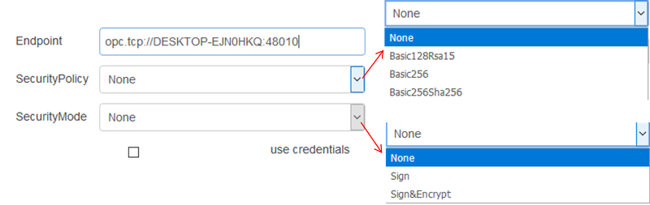
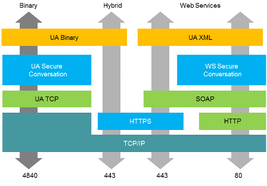

[<- На головну](../)  [Розділ](README.md)

## OpcUa-Endpoint

У даному вузлі налаштовується кінцева точка (Endpoint) до серверу OPC UA. 

рис.16.1. Налаштування OpcUa-Endpoint

Кінцева точка вказується в залежності від підтримуваного сервером транспорту (рис.16.2). Префікс (URL schema) “opc.tcp” (див.рис. вище) вказує на те що використовується обмін поверх TCP (OPC UA TCP). Доступні також схеми “opc.https” та “opc.http”.

рис.16.2. Використання в OPC UA різних протоколів