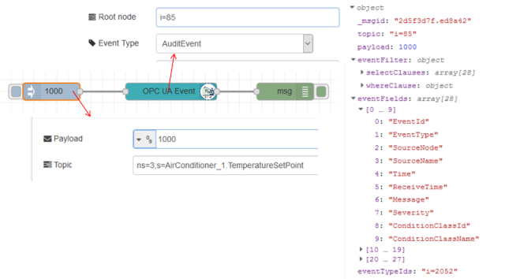

[<- На головну](../)  [Розділ](README.md)

## OpcUa-Event

Означує події OPC UA, які будуть підписані з сервера. Вихідне повідомлення з вузла необхідно подати на вузол OpcUA-Client з типом Action=EVENT . Кореневий вузол сервера буде використовуватися для перегляду вибраних подій під ним. Condition type (Тип умови) може залишатися порожнім, тоді всі об'єкти alarm/event будуть враховані.

​      На рис.16.12 показаний приклад, де видно як функціонує вузол OpcUa-Event. 

 рис.16.12. Приклад з функціонуючим вузлом OpcUa-Event

 