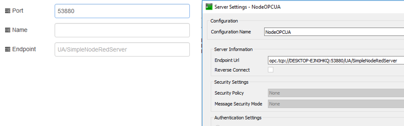
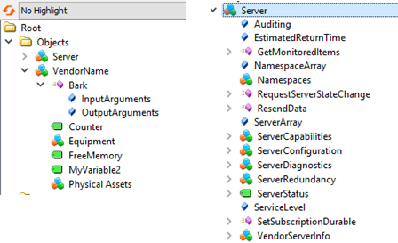
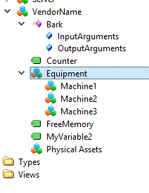

## OpcUa-Server

Для роботи OpcUA-Server’а Node-RED необхідно запускати з робочої папки користувача! Інакше може з’явитися повідомлення: 

Error: get-installed-path: module not found "node-opcua-server"

Створює  OPC UA server зі своїми змінними, структурами об’єктів і методами з кінцевою точкою: opc.tcp://hostname.local:53880/

Команди OPC UA server: 

- restartOPCUAServer
- addVariable
- addFolder
- setFolder
- addEquipment
- addPhysicalAsset
- deleteNode

У вузлі вказується тільки налаштування кінцевої точки, інше задається командою.



рис.16.13. Налаштування вузлу OpcUa-Server

Нижче наводяться приклади JSON команд.

Для перезапуску серверу треба відправити на вхід повідомлення з Payload рівним JSON:

```json
{ "opcuaCommand":"restartOPCUAServer" }
```

Після запуску або перезапуску усі раніше створені об’єкти видаляються, а об’єктна модель серверу має вигляд, як показано на рис.16.14. 

 

рис.16.14. Початкова об’єктна модель серверу після запуску/перезапуску.  

Команда «addEquipment» збільшує локальний лічильник обладнання на 1 і добавляє об’єкт обладнання в структуру об’єкту «Equipment» з іменем «nodeName» та номером лічильника. Наприклад: 

```json
{ "opcuaCommand": "addEquipment", "nodeName": "Machine" }
```

після 3-х викликів добавить з об’єкти, після чого об’єктна модель буде виглядіти наступним чином:



рис.16.15. Вигляд моделі після добавлення Equiment.

Аналогічним чином добавляється фізичний актив з використанням команди «addPhysicalAsset». Наприклад 4-ри рази подачі на вузол  повідомлення з Payload рівним 

```json
{ "opcuaCommand": "addPhysicalAsset","nodeName": "AssetNmbID_" }
```

приведе до добавлення в папку PhysicalAssets наступних об’єктів:


 

рис.16.16. Вигляд моделі після добавлення PhysicalAsset.

Для добавлення об’єкту іншого призначення у будь яке місце використовується команда «addFolder». Для розміщення об’єкту в потрібному місці, необхідно перейти на цей вузол з використанням команди «setFolder». Ця команда використовує адресу розміщення вузлу в полі Topic (рис.16.17)


рис.16.17. Налаштування Inject для відправки команди на встановлення активного вузлу (папки).

Після виконання команди, активним стане кореневий вузол «Objects». Якщо після цього викликати команду «addFolder», то в ній створиться новий об’єкт з вказаним ім’ям. 


рис.16.18. Створення об’єкту. 

 Для добавлення змінної використовується команда «addVariable». Добавлення змінної також проводиться в активний вузол. Так, наприклад, щоб добавити змінну в Machine1 з рис.16.15, треба спочатку викликати «setFolder» а потім «addVariable». Тоді результат буде як на рис.16.19.


рис.16.19. Добавлення змінної

Параметром «datatype» означують тип змінної. Підтримувані наразі типи даних:

- Int32

- Int16

- UInt32

- UInt16

- Double

- Float

- String

- Boolean 


Для видалення вузла використовується команда "deleteNode"

```json
{ "opcuaCommand": "deleteNode", "nodeId": "ns=4;s=PhysicalAsset2" }
```

Для зміни значення змінної наприклад в 45.6 використовується наступне повідомлення в форматі JSON :

```json
{ payload : { "messageType" : "Variable", "variableName": "Counter", "variableValue": 45.6 }};
```

