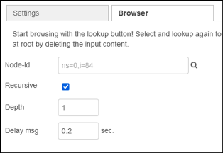
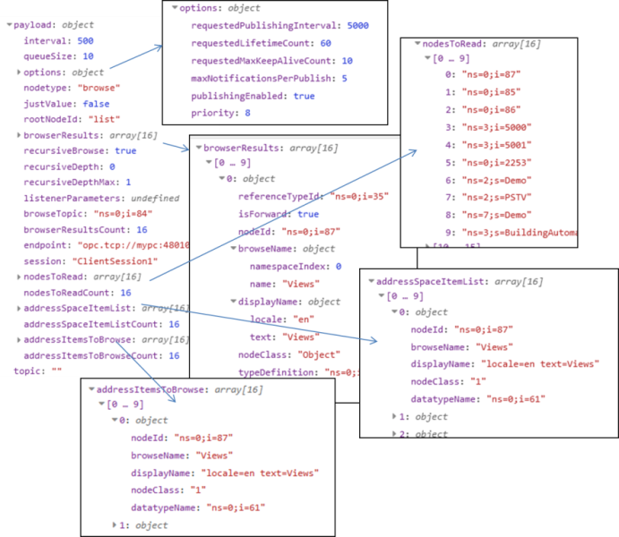

## OPC UA IIoT Browser

Використовуйте браузер для перегляду адресних просторів OPC UA. Зазвичай він починається з кореневої папки або об’єкта з використанням ідентифікатора вузла OPC UA, наприклад `ns=0;i=85` (root->Objects). Він також може отримати стан, щоб почати з будь-якого бажаного Node-Id як кореня в адресному просторі.

### Вкладка `Settings`

`Multiple outputs` - З опцією кількох виходів вихідні дані розбиваються в одне повідомлення для кожного `addressSpaceItem `, надіслане з попереднього вузла, і додаткове повідомлення, якщо Node-Id налаштовано на вкладці Browser. 

### Вкладка `browser `

`Node-Id`  - Встановлення початкового ідентифікатора вузла OPC UA за замовчуванням. Якщо перший раз пілся вставлення зробити розгортання проекту Node-RED, можна використовуйте кнопку пошуку, щоб знайти Node-Id (у мене не запрацювало). Очистіть текстове поле введення, щоб знову почати з root.

`Recursive` - Іноді вам потрібно переглянути структуру, і `crawler` отримує забагато даних. У цьому випадку ви можете спробувати працювати з рекурсивним переглядом, якщо сервер дозволяє цю операцію. У будь-якому випадку це не працює, але допомагає досягти кращих результатів????

`Depth` - 

`Dealy msg` - Параметр затримки на повідомлення допомагає отримати деякий час між кожним вихідним повідомленням.

### Вхід

Вхідні дані можуть бути порожніми або мають містити `addressSpaceItems` (масив об’єктів) для пошуку. Тут тип даних тут не потрібен – він просто вимагає `nodeId` в об’єктах `addressSpaceItems`.

### Вихід

Вихід повертає або структурований об’єкт JSON із запитаними даними, або повідомлення про помилки від node-opcua.

Content of a browse result: 

- payload (value) 

- - rootNodeId 
  - browserResults (Array of Objects) 
  - browserResultsCount 
  - recursiveBrowse 
  - recursiveDepth 
  - recursiveDepthMax 
  - listenerParameters 
  - browseTopic (node browse root) 
  - addressSpaceItems (input) 

- justValue 

- topic 

- nodetype (browse) 

- injectType (inject) 

- addressSpaceItems (Array of Objects to browse) 

- optional 

- - nodesToRead (Array of String resluts to read) 
  - nodesToReadCount 
  - addressItemsToRead (Array of Object results to listen)      
  - addressItemsToReadCount 
  - addressItemsToBrowse (Array of Object results to      browse) 
  - addressItemsToBrowseCount 

 