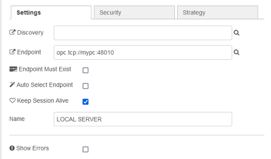
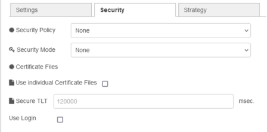
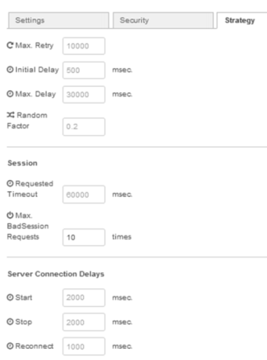

## OPC UA IIoT Connector

Конектор є вузлом конфігурації, який починає підключатися до сервера OPC UA за допомогою клієнта OPC UA миттєво після «розгортання» або запуску/перезапуску.

За замовчуванням для вузлів конфігурації встановлено значення "On all flows" - установіть для нього значення "flow", щоб вони видалялися, якщо ви видалите потік.

Connector — це одне підключення до вашого сервера OPC UA, яке обробляє сеанс. Якщо вам потрібно кілька підключень, використовуйте стільки вузлів Connector, скільки вам потрібно. Завдяки цьому ви можете побудувати своє уявлення про OPC UA в підключеннях до IIoT  або IoT .

### Вкладка Configuration

`Discovery` (optional lookup) - Деякі сервери надають порт виявлення, який відрізняється від порту кінцевої точки. Щоб виявити цей порт, встановіть його `opc.tcp://myopcuaserver.local:4840/`  Discovery — це лише для того, щоб надати деякий пошук. Конектор використовує лише кінцеву точку для відкриття з’єднання із сервером. Про Discovery можна почитати в [OPC UA Discovery and Endpoints](https://opcfoundation.org/wp-content/uploads/2014/08/12_UA_Discovery.pdf)

`Endpoint` - Адреса кінцевої точки (URI) сервера OPC UA, наприклад `opc.tcp://localhost:55388/` або `opc.tcp://mypcname.local:55388/`. Кінцева точка повинна існувати з назвою, якщо ця опція активована. Це забезпечує більшу цілісність у підключенні пристроїв. Автоматичний вибір правильної кінцевої точки не є обов’язковим і намагається знайти правильну кінцеву точку у ваших налаштуваннях безпеки.

`Keep Session Alive` - Якщо сеанси залишаться активними, встановіть для цього параметра прапорець. В іншому випадку він закриється під час очікування сеансу, і перший запит перезапустить сеанс, але ви не досягнете успіху з першим запитом. З опцією Keep alive сеанс продовжиться, і кожен запит буде успішним.

### Вкладка Security

Вкладка Security містить деякі параметри безпеки та опцію входу користувача. Захистіть свої дані за допомогою опцій безпеки OPC UA! 

`Security options`

- None 
- Basic256Sha256 
- Basic256Rsa15 
- Basic256 
- Basic192Rsa15 
- Basic128Rsa15 
- Aes256_Sha256_RsaPss 
- Aes128_Sha256_RsaOaep 

`Security mode`

- None 
- Sign 
- Sign&Encrypt 

`Certificates` - Використовуйте пакет `node-opcua-pki` або інші інструменти, щоб створити свою окрему пару ключів і встановіть тут шлях до файлу. В іншому випадку ви отримаєте попередньо встановлені ключі від node-opcua для захищеного зв’язку. Ви можете налаштувати власні сертифікати та файли приватних ключів. Це необов’язково. У режимі `None/NONE` ключі не використовуються.

`User Login` -  Вхід користувача призначений для аутентифікації користувача на сервері. Він зберігається з найкращою практикою облікових даних Node-RED.

`Name` - Ім'я у виборі конфігурації кінцевої точки.

Налаштуйте `showErrors`, щоб отримувати помилки від node-opcua під час перегляду (browse).

### Вкладка Strategy

Стратегія заснована на параметрах стратегії API node-opcua.

### Проблеми при підключенні до захищених серверів

У мене не вийшло підключитися до захищених серверів. Для поборення проблеми я зробив наступне:

- створив папку `certificates` в `C:\Users\username\.node-red\node_modules\node-opcua-client\dist`
- створив усі папки на шляху в папці `certificates` - `PKI\own\private\`
- скопіював туди сертифікат з `C:\Users\username\AppData\Roaming\node-opcua-default-nodejs\Config\PKI\own\private`
- перезапустив Node-RED