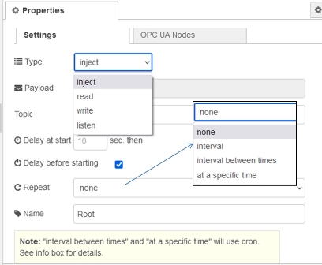
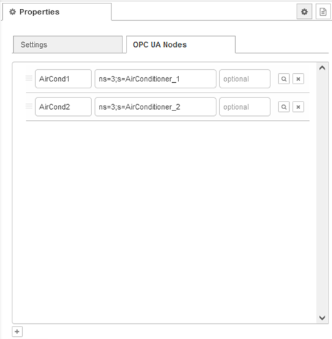

## OPC UA IIoT Inject

Модифікований вузол Inject призначений для надання деяких унікальних функцій, необхідних для створення потоків. Натискання кнопки ліворуч від вузла створює об’єкт введення для читання (read), перегляду (browse), прослуховування (listen) або запису (write) вузлами OPC UA IIoT.

Вихід з inject: 

- payload (value or options for listener) 
- topic 
- nodetype (inject, read, write, listen) 
- injectType (inject) 
- addressSpaceItems (Array of nodeId's) 

### Вкладка Settings



`Type` -  Установіть цей тип, щоб підготувати правильне значення для введння.

Зележність від Type:


`Interval` (для Inject-Type = listen) -  є можливість надіслати JSON payload, введену в Listener.

Наприклад:

```
{ "interval": 500, "queueSize": 10 }
msg.payload.options
```

event subscription parameters default: 

```
msg.payload.options = {
	requestedPublishingInterval: 100,
	requestedLifetimeCount: 60,
	requestedMaxKeepAliveCount: 10,
	maxNotificationsPerPublish: 4,
	publishingEnabled: true,
	priority: 3
}
```

subscription parameters default: 

```
msg.payload.options = {
	requestedPublishingInterval: 100,
	requestedLifetimeCount: 1000,
	requestedMaxKeepAliveCount: 12,
	maxNotificationsPerPublish: 100,
	publishingEnabled: true,
	priority: 6
}
```

`Payload` (для Inject-Type = read, write, inject) -  значення є стандартним корисним навантаженням для транспортування даних.

`Topic` - Тема полягає в групуванні для черг або протоколів, таких як MQTT.  

`Repeat` - За допомогою налаштувань повтору ви можете встановити конфігурацію cron.

Налаштування інтервалу потребує короткої затримки під час запуску. Це аналогічно опції "один раз", але без жодного введення в, щоб почати працювати. 

`Delay sec. at start` - має бути встановлений на мінімум для початку ін’єкцій на сервер OPC UA. Усі дії розпочнуться після того, як буде виконано початкове введення.

### Вкладка OPC UA Nodes

Вузол формує на виході масив addressSpaceItems, відповідно до добавлених записів в цій вкладці. 



`Name` (перше поле, optional) - Коротке ім’я, зрозуміле людині для довгих або числових ідентифікаторів вузлів.

`Node-Id` (друге поле, mandatory)  - Node-Id має бути дійсним Node-Id OPC UA `ns=0;i=85` (root->Objects) Ви можете використовувати наш вузол Browser для OPC UA, щоб знайти правильний ідентифікатор Node-Id.

`Data Type` (третє поле, mandatory/optional) - Налаштування типу даних потрібне для перетворення результатів типу Variant node-opcua. Тип даних при вказування запису є обов'язковим, для інших Inject-Type це необов'язково!

 