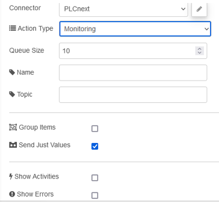

## OPC UA IIoT Listener

Вузол Listener має налаштувати моніторинг адресного простору або Alarm&Events вашого сервера OPC UA. Потрібна лише одна ін’єкція, щоб налаштувати запуск моніторингу. Для кожної ін’єкції він працює як тригер – моніторинг підписки-відписки або тривоги та події.



### Input

- payload     (number*/Object) 

- - interval      (number*) 
  - queueSize      (number) 
  - options      (Object) 

- topic 

- nodetype     (inject) 

- injectType     (listen/browse*) 

- addressSpaceItems  or addressItemsToRead* (Array of Objects) 

#### Inject payload JSON

Наприклад:

```json
{
    "interval": 500,
    "queueSize": 10,
    "options": {
        "requestedPublishingInterval": 5000,
        "requestedLifetimeCount": 60,
        "requestedMaxKeepAliveCount": 10,
        "maxNotificationsPerPublish": 5,
        "publishingEnabled": true,
        "priority": 8
    }
}
```

Інтервал параметра означає інтервал вибірки. Якщо ви хочете встановити інтервал публікації, вам потрібно надіслати трохи більше параметрів.

##### msg.payload.options

##### **event subscription parameters default:** 

```json
msg.payload.options = {
    requestedPublishingInterval: 100,
    requestedLifetimeCount: 60,
    requestedMaxKeepAliveCount: 10,
    maxNotificationsPerPublish: 4,
    publishingEnabled: true,
    priority: 3
}
        
```

##### **subscription parameters default:** 

```
msg.payload.options = {
    requestedPublishingInterval: 100,
    requestedLifetimeCount: 1000,
    requestedMaxKeepAliveCount: 12,
    maxNotificationsPerPublish: 100,
    publishingEnabled: true,
    priority: 6
}
```

The sampling interval and the publishing interval is to tell you want to sample every n interval in msec. and it should publish every n msec. 

Example: `interval`: 200, `queueSize`: 5, and `requestedPublishingInterval`: 1000 

- samples every 200 msec. and publishing changes every second (1000 msec.) with max. 5 values 

### Output 1

#### All Mode

**Result in message:**

- payload     (object) 
- topic 
- addressSpaceItems     (Array) 
- nodetype     
- injectType     
- readtype     
- result     (origin from node-opcua) 
- mode     (all/value) 

#### Value Mode

**Result in subscribe message:**

- payload 

- - name      
  - nodeId      
  - value      

- topic 

- addressSpaceItems     (Array) 

- injectType     

- readtype     

- mode     (all/value) 

### Output 2

That output provides the origin from node-opcua as JSON.

Цей вихід надає джерело з node-opcua як JSON.

 