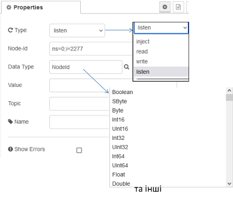
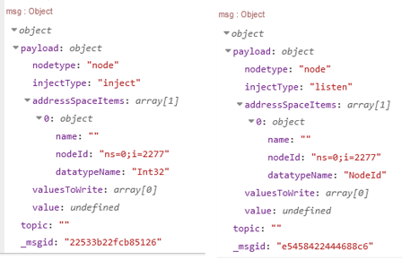

## OPC UA IIoT Node

`Node` має налаштувати потік із вузлом Node-RED Inject, щоб надати OPC UA `injectType`, `nodeId` та `parameters`.

Приклади формування повідомлень на виході

 

### Вхід

Не відповідає дійсності

Event message:

`payload`  -   Value 

`topic` -  Node-Id 

### Вихід

Не відповідає дійсності

Event message:

- payload - (payload or value) 
- topic  - Node-Id 
- datatype     (node-opcua/OPC UA data type string) 
- nodetype     (node) 

Value - Вхідне значення призначене для запису фіксованого значення до заданого OPC UA Node-Id. Він перевизначає дане payload, якщо воно не є нульовим. Значення має бути в кільці типу даних.

