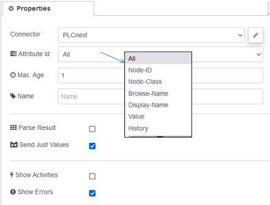

## OPC UA IIoT Read

Вузол Read призначений для опитування даних із сервера OPC UA. Він обробляє один запит даних або кілька запитів даних. Введення кількох ідентифікаторів вузлів запитує і виробляє масив даних адресного простору. Окрема ін’єкція Node-Id зчитує лише значення та надсилає його через корисне навантаження.

### Вхід

- `nodesToRead`  або `addressSpaceItems` (Array of Objects with property nodeId) 

- `payload`    (optional) 

  - `maxAge`      (number) 

  - `historyStart`  (date) 
  - `historyEnd` (date) 

### Вихід

OPC UA results containing `nodesToRead` and Injects sending `addressSpaceItems`.

Будь ласка, використовуйте вузол `Result Filter` для обробки виводу вузла Read.

Результат запиту в повідомленні:

- `payload`    (Array/Object or String if not to parse) 

  - `results`      

  - `nodesToRead`      

- `topic` 

- `nodetype`     

- `readtype`     

- `attributeId`     

- `resultsConverted` (Array/Object of results or null if not to parse) 

Максимальний вік значення для зчитування в мілісекундах (see [node-opcua API](http://node-opcua.github.io/api_doc/classes/ReadRequest.html)) 

Глибина для читання, наприклад, компонентів. (див node-opcua API)

**Name** 

Name in the flow of Node-RED.

With that option, the node does not send an object on out two for less CPU load.

Set showErrors to get errors from node-opcua on browse.