## node-red-contrib-iiot-opcua

<https://github.com/BiancoRoyal/node-red-contrib-iiot-opcua>

The IoT/IIoT OPC UA toolbox package for Node-RED based on [node-opcua](https://github.com/node-opcua/node-opcua).

| Вузол                                                        | Призначення                                                  | Примітка |
| ------------------------------------------------------------ | ------------------------------------------------------------ | -------- |
|  | [opcuaiiot_connector](opcuaiiot_connector.md) - конфігураційний вузол підключення до сервера OPC UA | 2022     |
| 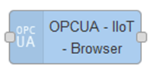 | [opcuaiiot_browser](opcuaiiot_browser.md)                    |          |
| 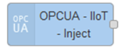 | [opcuaiiot_inject](opcuaiiot_inject.md) - фомування msg для інших вузлів бібліотеки |          |
| 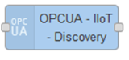 | [opcuaiiot_discovery](opcuaiiot_discovery.md)                |          |
|  | [opcuaiiot_event](opcuaiiot_event.md)                        |          |
| 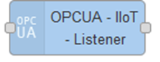 | [opcuaiiot_listener](opcuaiiot_listener.md) - налаштування моніторингу адресного простору або Alarm&Events |          |
| 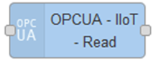 | [opcuaiiot_read](opcuaiiot_read.md)                          |          |
| 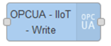 | [opcuaiiot_write](opcuaiiot_write.md)                        |          |
| 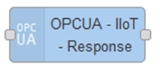 | [opcuaiiot_response](opcuaiiot_response.md)                  |          |
| 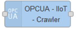 | [opcuaiiot_crawler](opcuaiiot_crawler.md)                    |          |
| 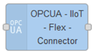 | [opcuaiiot_flex_connector](opcuaiiot_flex_connector.md)      |          |
| 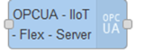 | [opcuaiiot_flex_server](opcuaiiot_flex_server.md)            |          |
| 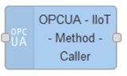 | [opcuaiiot_method_caller](opcuaiiot_method_caller.md)        |          |
| 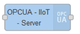 | [opcuaiiot_server](opcuaiiot_server.md)                      |          |
| 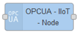 | [opcuaiiot_node](opcuaiiot_node.md) - налаштування параметрів Node для інших вузлів OPC |          |
| 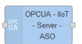 | [opcuaiiot_server_aso](opcuaiiot_server_aso.md)              |          |
| 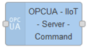 | [opcuaiiot_server_command](opcuaiiot_server_command.md)      |          |
| 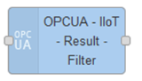 | [opcuaiiot_result_filter](opcuaiiot_result_filter.md)        |          |

### Basic Flow

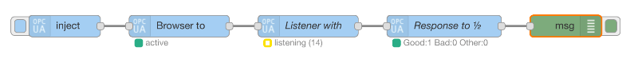

### Ваша власна модель адресного простору!

За допомогою flex-сервера ви можете створити власну інформаційну модель з адресним простором OPC UA.

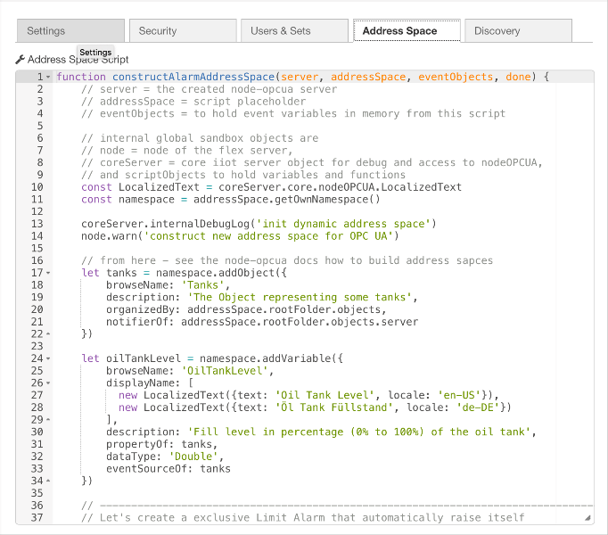

### Вчіться на прикладах!

Вузол сервера містить демонстраційні об’єкти та змінні, щоб почати гру з операціями виклику методу OPC UA, читання та запису.

див Node-RED menu (right upper corner) -> Import -> Examples -> iiot opcua

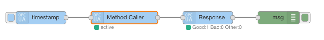

**... безпечне зчитування з серверів OPC UA з вашими власними парами ключів ...**

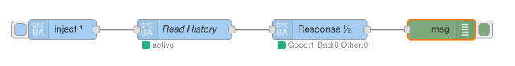

**... і безпечне записування та переміщення даних між серверами OPC UA...**

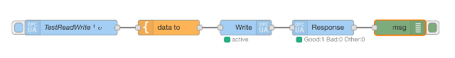

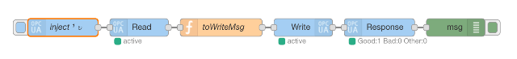

**... створювати власні змінні та об’єкти з подій ...**

| Node-RED                                    | UAExpert / Client                                    |
| ------------------------------------------- | ---------------------------------------------------- |
| 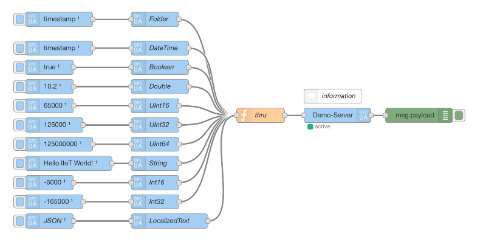 | 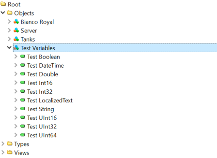 |

### Повторне підключення через події за допомогою Flex Connector! 

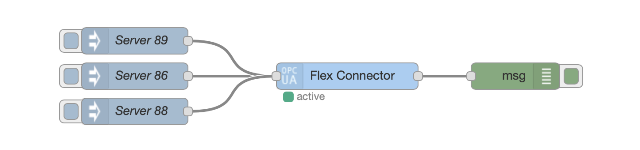

## 