[<- На головну](../)  [Розділ](README.md)

# node-red-contrib-buffer-parser

## Вступ

https://github.com/Steve-Mcl/node-red-contrib-buffer-parser

Пара вузлів Node-RED для перетворення значень у буфер/масив і назад. Підтримує Big/Little Endian, BCD, переставлення байтів та багато іншого. Краще один раз побачити, ніж сто разів почути. 

Перетворює масив цілих чисел на окремі повідомлення `topic/payload` – ідеально підходить для відправки в MQTT.

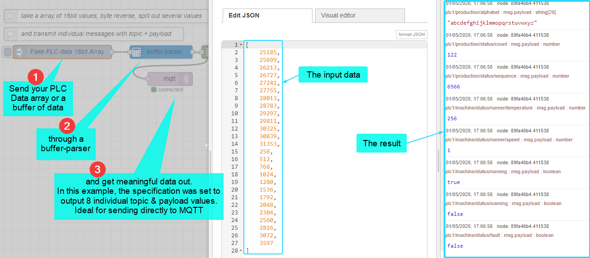

Перетворює буфер у пари ключ/значення – ідеально підходить для відправки на дашборд або в базу даних.

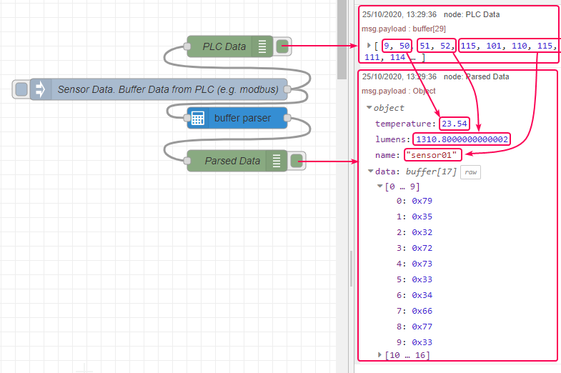

Fan out - це режим, за якого вузол Node-RED створює кілька вихідних контактів, і кожен результат надсилається через власний вихід.

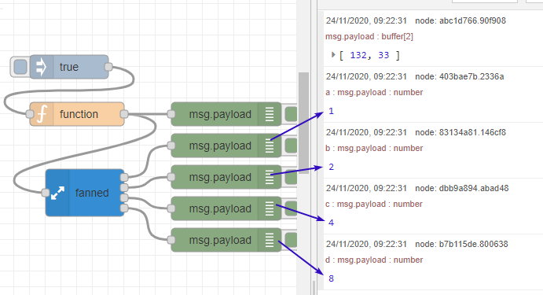

Масштабування кінцевих значень

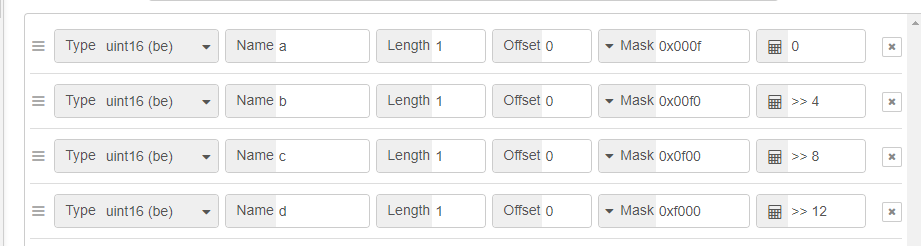

## Вузол buffer-parser

 перетворює масив цілих чисел (Int16) або буфер на об’єкт значень відповідно до наданої специфікації.

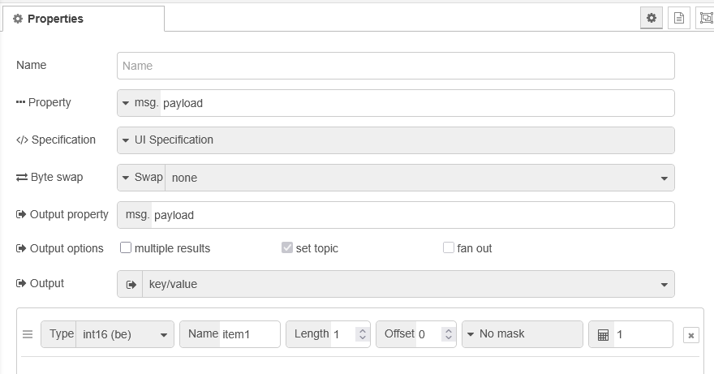

### Налаштування через вікно властивостей 

- `Property` - Дані, що підлягають обробці відповідно до специфікації. Дані мають бути буфером або масивом 16-бітних цілих чисел.

- `Specification...` - Якщо Specification встановлено як "UI", тоді введіть специфікацію у полях, наведених нижче. В іншому випадку специфікація має бути об’єктом у форматі, описаному нижче в `Dynamic specification`
  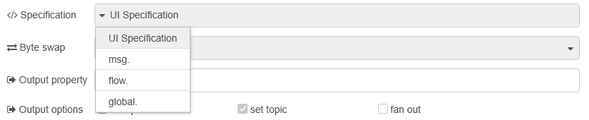

- `Byte swap...` - Swap дозволяє виконати 16-бітне, 32-бітне або 64-бітне переставлення байтів. Переставлення застосовується до всіх даних перед вилученням вказаних елементів. Якщо перший параметр swap заданий як `msg`, `flow` або `global`, то він має бути масивом, що містить будь-яку кількість рядків "swap16", "swap32", "swap64". Якщо перший параметр `swap` заданий як `env`, тоді змінна середовища має містити список переставлень, розділених комами, напр. `swap32,swap16`.

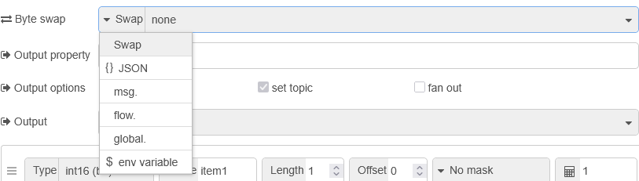

- `Output property...` - Дозволяє повертати результат у властивість, відмінну від payload. Наприклад, результати можна повертати у `msg.output` або `msg.result.data`.

- `Output options...` 

  - `multiple results` - Якщо `false`, у вказану в `Output property` властивість `msg` повертається один результат. Якщо `true`, повертається 1 результат на елемент у тій самій властивості `msg`.

  - `set topic` - Якщо `false`, `msg.topic` не змінюється. Якщо `true`, `msg.topic` встановлюється у значення `name`.

  - `fan out` - Якщо `true`, у вузлі додаються кілька вихідних контактів, і кожен результат надсилається через свій власний вихід.

- `Output...` 

  -  `key/value` - Якщо вибрано `key/value`, у payload буде лише значення. Використовуйте подвійний символ `=>` у name, щоб створювати вкладені властивості об’єкта. Напр., `motor1=>power` перетвориться на `msg.payload.motor1.power`.

  - `key/object` Якщо вибрано `key/object`, у `payload` буде об’єкт. Використовуйте `=>` у name так само для вкладених властивостей.

  - `value only` - Якщо вибрано `value only`, `payload` буде масивом значень.

  - `array` - Якщо вибрано `array`, `payload` буде масивом об’єктів.

  - `buffer` - Якщо вибрано `buffer`, payload буде буфером. Примітка: жоден елемент не буде оброблений (але переставлення байтів буде застосоване).
    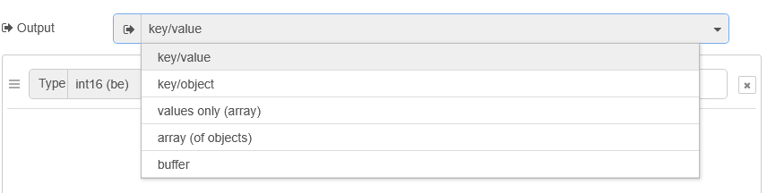

- `items...`

  - `name` - назва для ідентифікації отриманих даних. Може також використовуватися як topic при поверненні кількох значень.

  - `type` - Тип, у який мають бути перетворені вихідні дані (див. `Allowable types` нижче).

    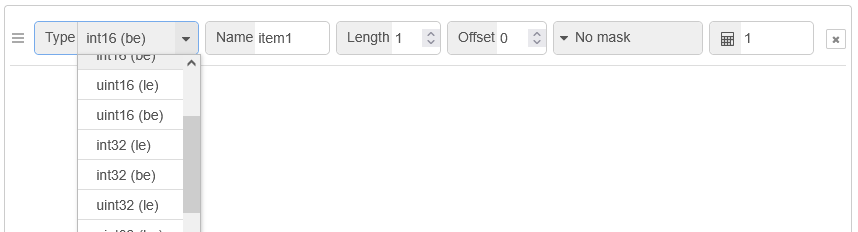

  - `offset` - Значення зсуву визначає, з якого байта починати зчитування даних. Незалежно від джерела (буфер або масив цілих чисел).
     Напр., якщо джерело — масив цілих чисел і задано `3`, то читання почнеться з середини другого WORD.

  - `length` - Кількість елементів, які потрібно повернути, напр. `6 bool`, `12 float` або `34 int32`. Примітка: якщо встановити `length = -1`, буде зроблена спроба зчитати всі байти від offset до кінця. Якщо у вихідних даних не вистачає байтів, операція завершиться помилкою.

  - `offsetbit` - Перший біт для повернення при типі bool. Напр., `offsetbit = 6` і `length = 3` дасть: `byte0-bit6`, `byte0-bit7` і `byte1-bit0`.

  - `mask` - Необов’язкова маска для застосування до кінцевого значення даних. Можна вводити десяткове (напр. 65535) або шістнадцяткове значення (напр. 0xffff).

  - `scale` - Множник або проста формула масштабування для застосування до кінцевого значення (після маски). Підтримуються такі формули:
    - `<<` напр. `<<2` — зсув вліво на 2 біти
    - `>>` напр. `>>2` — зсув вправо на 2 біти
    - `>>>` напр. `>>>2` — беззнаковий зсув вправо на 2 біти (повертає 32-бітне беззнакове значення)
    - `+` напр. `+10` — додати 10
    - `-` напр. `-10` — відняти 10
    - `/` напр. `/10` — поділити на 10
    - `` напр. `10` — помножити на 10
    - `^` напр. `2` — піднести до степеня 2
    - `` напр. `^0xf0` — виконати XOR зі значенням 0xf0
    - `==` напр. `==10` — повертає `true`, якщо значення дорівнює 10
    - `!=` напр. `!=10` — повертає `false`, якщо значення дорівнює 10
    - `!!` напр. `!!` — повертає `true`, якщо значення дорівнює `1` (еквівалент `!!1 == true`)
    - `>` напр. `>10` — повертає `true`, якщо значення більше за 10
    - `<` напр. `<10` — повертає `true`, якщо значення менше за 10

### Динамічні налаштування через властивості `msg`

`specification` може передаватися через `msg`, `flow` або `global` замість конфігурування через UI. Динамічна специфікація повинна бути об’єктом із такими властивостями:

- `options` (Object) – параметри обробки
- `items` (Array) – масив елементів (див. нижче)

Об’єкт options може мати такі властивості:

- `byteSwap` (Boolean|Array|optional) – переставити всі байти перед обробкою елементів. Якщо `true`, виконується `swap16`. Якщо `byteSwap` є масивом (наприклад, `["swap64", "swap32", "swap64", "swap16"]`), переставлення виконується у вказаному порядку.
- `resultType` (String|optional) – спосіб повернення даних. Допустимі варіанти: `"object"`, `"keyvalue"`, `"array"`, `"value"`, `"buffer"`.
- `msgProperty` (String|optional) – властивість, у якій будуть результати. За замовчуванням дані надсилаються у `msg.payload`. Це можна змінити.
   Наприклад, якщо задати msgProperty = `newPayload.data`, то результати будуть у `msg.newPayload.data`.
- `multipleResult` (Boolean|optional) – за замовчуванням наприкінці обробки надсилається один результат.
   Якщо встановити `true`, тоді окремі повідомлення будуть надсилатися для кожного елемента.
- `setTopic` (Boolean|optional) – коли multipleResult = `true`, у кожному повідомленні topic буде встановлено у значення item.name (або індекс елемента, якщо name не задано). Щоб запобігти перезапису topic, встановіть setTopic = `false`.

Масив `items` повинен містити один або більше об’єктів у такому форматі (не використовується, коли `resultType` = "buffer"):

- `name` (String) – назва для ідентифікації отриманих даних. Також може використовуватися як topic при поверненні кількох значень.
- `type` (String) – тип, у який мають бути перетворені вихідні дані (див. Allowable types нижче).
- `offset` (Number) – байт, з якого починати зчитування даних. Незалежно від того, чи джерело – буфер, чи масив цілих чисел. Напр., якщо джерело – масив цілих чисел і offset = 3, то дані почнуть зчитуватися з середини другого WORD.
- `length` (Number|optional) – кількість елементів, які потрібно повернути. Напр., 6 bool, 12 float або 34 int32. Примітка: якщо встановити `length = -1`, буде зроблена спроба зчитати всі байти від offset до кінця.  Якщо у вихідних даних не вистачає байтів, операція завершиться помилкою.
- `offsetbit` (Number|optional) – перший біт для повернення при типі bool. Напр., `offsetbit = 6` і `length = 3` дає: `byte0-bit6`, `byte0-bit7`, `byte1-bit0`.
- `mask` (Number|String|optional) – необов’язкова маска для застосування до кінцевого значення. Напр., десяткове `65535` або шістнадцяткове `0xffff`.
- `scale` (Number|optional) – множник для застосування до кінцевого значення. Напр., 0.1 ділить значення на 10, а 10 множить значення на 10.

Допустимі типи (Allowable types):

- int, int8, byte, uint, uint8
- int16, int16le, int16be, uint16, uint16le, uint16be
- int32, int32le, int32be, uint32, uint32le, uint32be
- bigint64, bigint64le, bigint64be, biguint64, biguint64le, biguint64be
- float, floatle, floatbe, double, doublele, doublebe
- 8bit, 16bit, 16bitle, 16bitbe, bool
- bcd, bcdle, bcdbe
- string, hex, ascii, utf8, utf16le, ucs2, latin1, binary, buffer

Примітки:

- Якщо не вказано `le` (little endian) або `be` (big endian), за замовчуванням приймається `be`.
- `bcd` перетворює число у 4BCD-еквівалент (`bcd` не є стандартною функцією buffer).
- `bool` повертає масив значень `true`/`false`. Якщо порядок бітів неправильний, можна переставити дані в options або передати значення як int16be, int16le, int32be, int32le (тощо) в інший вузол для конвертації в boolean.
- Операції з bigint64 повертають об’єкт BigInt, який має особливу поведінку. Див. [документацію BigInt](https://developer.mozilla.org/en-US/docs/Web/JavaScript/Reference/Global_Objects/BigInt).
- Для `key/value` та `key/object` символ `=>` створює підоб’єкти. Напр., name = `motor1=>power` створить об’єкт `motor1` з властивістю `power`.
- Див. [документацію Buffer у Node.js](https://nodejs.org/api/buffer.html) для додаткових деталей.

Приклад динамічної специфікації:  

```json
{
    "options": {
        "byteSwap": ["swap32", "swap16"],
        "resultType": "object",
        "multipleResult": true,
        "setTopic": true,
        "msgProperty": "payload"
    },
    "items": [
        {
            "name": "digit1",
            "type": "int",
            "offset": 4,
            "mask": "0x00f0"
            "scale": ">> 4"
        },
        {
            "name": "myInt16Array_LE_divided_by_100",
            "type": "int16le",
            "offset": 26,
            "length": 6,
            "scale": 0.01
        },
        {
            "name": "myInt16Array_BE",
            "type": "int16be",
            "offset": 26,
            "length": 6
        },
        {
            "name": "booleans",
            "type": "bool",
            "offset": 0,
            "length": 16
        },
        {
            "name": "16bits",
            "type": "16bit",
            "offset": 0
        },
        {
            "name": "myString",
            "type": "string",
            "offset": 0,
            "length": -1
        }
    ]
}
        
```

## Вузол buffer-maker

 перетворює вхідні елементи даних у буфер відповідно до наданої специфікації.

### Налаштування через вікно властивостей 

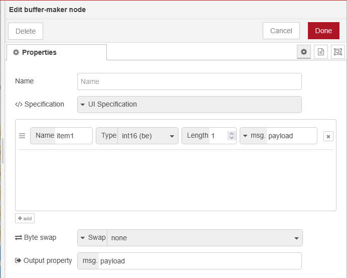


- `Property...` - дані, які потрібно обробити відповідно до специфікації.

- `Specification...` -  Якщо Specification встановлено як "UI", тоді введіть специфікацію у полях, наведених нижче. В іншому випадку специфікація має бути об’єктом у форматі, описаному нижче в [Dynamic specification](http://127.0.0.1:1880/#buffer-maker-help-dyn-spec).

  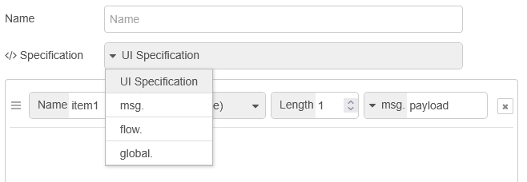

- `Byte swap...` - Swap дозволяє виконати 16-бітне, 32-бітне або 64-бітне переставлення байтів. Переставлення застосовується до всіх даних перед вилученням вказаних елементів. Якщо перший параметр `swap` заданий як `msg`, `flow` або `global`, то він має бути масивом, що містить будь-яку кількість рядків "swap16", "swap32", "swap64". Якщо перший параметр swap заданий як `env`, тоді змінна середовища має містити список переставлень, розділених комами, напр. `swap32,swap16`.

  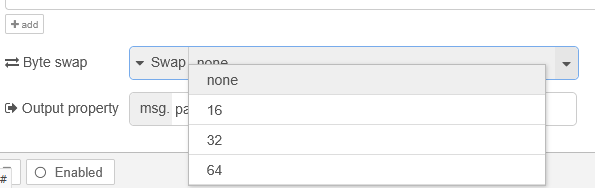

- `Output property...` Дозволяє повертати результат у властивість, відмінну від `payload`. Наприклад, результати можна повертати у `msg.output` або `msg.result.data`.

- `items...`

  - `name` – назва для ідентифікації отриманих даних.

  - `type` – тип, у якому вхідні дані повинні бути записані у буфер (див. Allowable types нижче).

  - `length` – кількість елементів, які мають бути записані у буфер, напр. `12 float` або `34 int32`. Примітка: якщо встановити `length = -1`, буде зроблена спроба зчитати всі елементи з вхідного масиву даних. Примітка: якщо у вхідних даних не вистачає байтів, операція завершиться помилкою.

### Динамічні налаштування через властивості `msg`

- `specification` може передаватися через `msg`, `flow` або `global` замість конфігурування через UI. Динамічна специфікація повинна бути об’єктом із такими властивостями:

  - `options (Object)` – параметри обробки

  - `items (Array)` – масив елементів (див. нижче)

Об’єкт `options` може мати такі властивості:

- `byteSwap` (Boolean|Array|optional) – переставити всі байти перед обробкою елементів. Якщо `true`, виконується `swap16`. Якщо `byteSwap` є масивом (наприклад, `["swap64", "swap32", "swap64", "swap16"]`), переставлення виконується у вказаному порядку.
- `msgProperty` (String|optional) – властивість, у яку будуть повернуті дані. За замовчуванням дані надсилаються у `msg.payload`. Це можна змінити за потреби.  Наприклад, якщо встановити msgProperty = `newPayload.data`, то результати будуть у `msg.newPayload.data`.

Масив `items` повинен містити один або більше об’єктів у такому форматі (не використовується, коли `resultType` = "buffer"):

- `name` (String) – назва для ідентифікації отриманих даних.
- `type` (String) – тип, у якому вхідні дані мають бути записані у буфер (див. Allowable types нижче).
- `length` (Number|optional) – кількість елементів, які потрібно записати у буфер, напр. `12 float` або `34 int32`. Примітка: якщо встановити `length = -1`, буде зроблена спроба зчитати всі елементи з вхідного масиву даних.  Примітка: якщо у вхідних даних не вистачає байтів, операція завершиться помилкою.

Допустимі типи (Allowable types):

- int, int8, byte, uint, uint8
- int16, int16le, int16be, uint16, uint16le, uint16be
- int32, int32le, int32be, uint32, uint32le, uint32be
- bigint64, bigint64le, bigint64be, biguint64, biguint64le, biguint64be
- float, floatle, floatbe, double, doublele, doublebe
- 8bit, 16bit, 16bitle, 16bitbe, bool
- bcd, bcdle, bcdbe
- string, hex, ascii, utf8, utf16le, ucs2, latin1, binary, buffer

Примітки:

- Якщо не вказано `le` (little endian) або `be` (big endian), за замовчуванням приймається `be`.
- `bcd` перетворює число у 4BCD-еквівалент (bcd не є стандартною функцією buffer).
- Дані `bool` повинні надаватися у вигляді масиву, напр. `[true,true,false,false]`.
- Дані `8bit` повинні надаватися у вигляді масиву з 8-бітних масивів, напр.
   `[ [1,0,0,1,1,0,0,1], [1,1,0,0,1,1,0,0] ]`.
- Дані `16bit` повинні надаватися у вигляді масиву з 16-бітних масивів, напр.
   `[ [1,0,0,1,1,0,0,1,1,0,0,1,1,0,0,1], [1,1,0,0,1,1,0,0,1,1,0,0,1,1,0,0] ]`.

```json
{
    "options": {
        "byteSwap": ["swap32", "swap16"],
        "msgProperty": "payload"
    },
    "items": [
        {
            "name": "myInts",
            "type": "int",
            "length": 6,
            "data": "payload.myInts"
            "dataType": "msg"
        },
        {
            "name": "myInt16ArrayInFlow",
            "type": "int16be",
            "length": 6,
            "data": "myInt16Array"
            "dataType": "flow"
        },
        {
            "name": "booleans",
            "type": "bool",
            "length": 8,
            "data": "[true,true,false,false,true,true,false,false]"
            "dataType": "json"
        },
        {
            "name": "16bits",
            "type": "16bit",
            "length": 1,
            "data": "[1,1,0,0,1,0,1,0,1,1,0,0,1,0,1,0]"
            "dataType": "json"
        },
        {
            "name": "myString",
            "type": "string",
            "length": -1,
            "data": "title",
            "dataType": "global"
        }
    ]
}
        
```