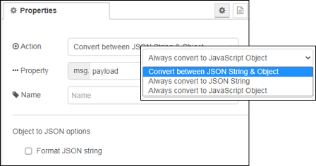

[<- На головну](../)  [Розділ](README.md)

## JSON

 Перетворює рядки JSON в об’єкти JavaScript та в зворотному напрямку.

На вхід подаються властивості:

- `payload` (*object | string*) -- JavaScript object або JSON string.

- `schema` (*object*) -- Опціональний об'єкт типу JSON Schema для валідації payload. Властивість буде видалено до відправлення `msg` на наступний вузол.

Вузол формує повідомлення з властивостями:

- `payload`(*object | string*)
  - якщо вхід є JSON string вузол спробує видати JavaScript object.
  - якщо вхід є JavaScript object, вузол створить JSON string. String може необов'язково бути добре відформатованим. 

- `schemaError` (*array*) -- якщо перевірка схеми JSON не вдається (див `shema`), вузол `catch` отримає властивість `schemaError`, що містить масив помилок.

За замовчуванням вузол працює з `msg.payload`, але може бути налаштований для перетворення з будь-якої властивості повідомлення.

Вузол також може бути налаштований так, щоб забезпечити частинне кодування замість перемикання між ними. Це може бути використано, наприклад, для вузла  `HTTP In` , щоб забезпечити корисне навантаження парсованим об'єктом, навіть якщо вхідний запит не встановив правильний тип вмісту для вузла `HTTP In` для перетворення.

Якщо вузол налаштований так, щоб властивість було закодовано як String, і він отримав String, додаткові перевірки властивості не проводитимуться. Він не перевірить, що String є дійсним JSON, і не буде переформатувати його, якщо обрано параметр формату.

Для отримання більш детальної інформації про схему JSON ви можете ознайомитися зі специфікацією [тут](http://json-schema.org/latest/json-schema-validation.html).

