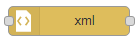
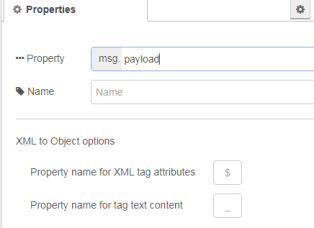

[<- На головну](../)  [Розділ](README.md)

## XML

 Перетворює рядок XML в об’єкт JavaScript та в зворотному напрямку напрямку.



На вході очікує властивості:

- `payload` (*object | string*) -- JavaScript object або XML string.

- `options`(*object*) -- цю необов'язкову властивість можна використовувати для передачі будь-якого з параметрів, підтримуваних базовою бібліотекою, що використовується для перетворення в XML і з нього. Докладнішу інформацію див. у документах [the xml2js docs](https://github.com/Leonidas-from-XIV/node-xml2js/blob/master/README.md#options)

На виході вузол формує повідомлення:

- `payload` (*object | string*)
  - якщо вхід є string, вузол пробує парсити його як XML та перетворити в JavaScript object.
  - якщо вхід є JavaScript object він пробує з нього створити XML string.

При перетворенні між XML і об'єктом будь-які атрибути XML додаються як властивість за назвою `$` за замовчуванням. Будь-який текстовий вміст додається як властивість під назвою `_`. Ці імена властивостей можна вказати в конфігурації вузла.

Наприклад, наступний фрагмент XML 

```
<p class="tag">Hello World</p>
```


буде конвертовано в об'єкт:

```json
{
  "p": {
    "$": {
      "class": "tag"
    },
    "_": "Hello World"
  }
}
```

