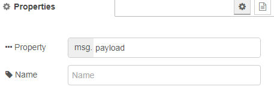

[<- На головну](../)  [Розділ](README.md)

## YAML

 Перетворює рядок, відформатований в форматі YAML у об'єкт JavaScript та в зворотному напрямку.

На вхід очікується `payload` (*object або string*) -- JavaScript object або YAML string.

На виході формується `payload` (*object або string*):

- якщо вхід є YAML string вузол спробує сформувати JavaScript object.
- якщо вхід є JavaScript object вузол створить YAML string.

Про мову YAML можете прочитати [за посиланням](https://pupenasan.github.io/ProgIngContrSystems/%D0%9B%D0%B5%D0%BA%D1%86/yaml). 

