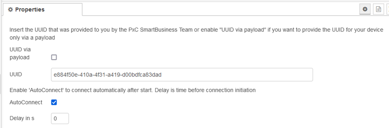
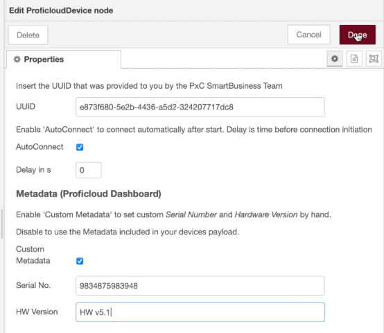
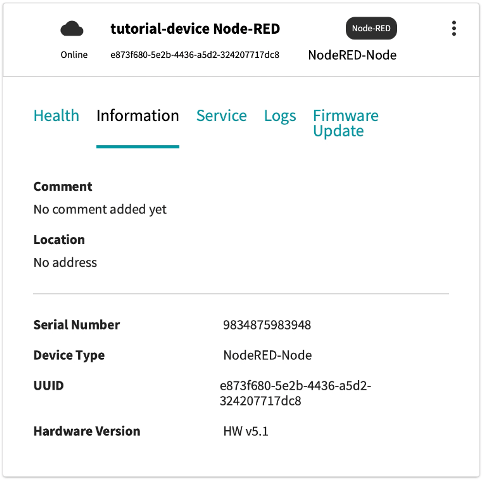
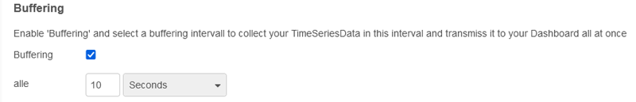

[<- На головну](../)

# NodeRED ProficloudNodes

https://flows.nodered.org/node/node-red-contrib-proficloud

Ці вузли можна використовувати для підключення до платформи IIoT від Phoenix Contact the [Proficloud](https://proficloud.io) Щоб використовувати вузли ProficloudDevice, вам потрібно мати node-red версії 2.2.2 або новішої, а також node js версії 12.22.8 або новішої.

Деталі про використання сервісу читайте [за посиланням](https://pupenasan.github.io/plcnext/service_components/proficloud/)

Вузол `ProficloudDevice`: цей вузол представляє віртуальний пристрій [Proficloud](https://proficloud.io). Ви можете налаштувати метадані в конфігурації вузла. TSD, TrafficLight і Logs надсилатимуться через вхід вузла. 

## Налаштування для реєстрації на платформі



UUID для віртуальних вузлів генерується автоматично на платформі, необхідно його сюди скопіювати. Можна не лише встановити UUID вузла безпосередньо в налаштуваннях вузла, але й надіслати його через корисне навантаження. Для цього необхідно поставити відповідну опцію. Приклад payload:

```js
msg = {};
msg.payload = {"config" : {"uuid": "873c543f-d3bd-43e1-bc47-982c0109566f"}};
return msg;
```

## Метадані

[Джерело](https://proficloud.io/courses/get-to-know-node-red-and-proficloud-io/lessons/set-static-metadata/)

Пристрої можуть надсилати метадані на Proficloud.io, включивши їх у своє корисне навантаження. Ви можете змінити метадані пристрою, увімкнувши опцію `Custom Metadata` у вузлі пристроїв Proficloud у Node-RED. 



`Custom Metadata` ввімкнено за умовчанням. Введіть значення для *Serial Number*, *Firmware Version* та *Hardware Version*. Після розгортання потоку вони з’являться на вкладці `Information` службиDevice Management Service Proficloud.io.



## Traffic Light

`TrafficLight`:  `traffic light` відображатиметься кольором і статусом `Device status` у Device Management Service. Для вузла потрібен об’єкт `msg.payload.trafficLight` із кольором (`0` = зелений, `1` = помаранчевий, `2` = червоний) і повідомленням, яке відображатиметься як `Device status`. Жоден з них не повинен бути відсутнім. Приклад корисного payload:

```js
msg = {};
msg.payload = {"trafficlight": {"color": 2, "msg": "Some errors"}};
return msg;
```

## Time Series Data Service

Для збереження даних використовується Time Series Data Service. Дані можна буферизувати за вказаний період часу.



`TimeSeriesData`: Надішліть об’єкт `msg.payload.data` на вхід вузла. Він надсилає дані в хмару, щоб візуалізувати їх на інформаційній панелі в службі Time Series Data  Service. Зауважте, що назви ваших показників (метрик) не можуть містити жодних спеціальних символів окрім `-` і `_`.

Приклад payload:

```js
msg = {};
msg.payload = {"data" : {"humidity": 12.0, "temp": 2.0}};
return msg;
```

`External Timestamps`: щоб надіслати зовнішню мітку часу разом із вашими даними, потрібно надіслати мітку часу UTC у мілісекундах. Приклад payload:

```js
msg = {};
msg.payload = {"data: {"timestamp": 12343423423, "humidity": 12.0, "temp": 2.0}};
return msg;
```

Ви також можете надсилати кілька позначок часу та даних одночасно. Приклад payload:

```js
msg = {}
msg.payload = {"data: [{"timestamp": 12343423423, "humidity": 12.0, "temp": 2.0}, {"timestamp": 12343423425, "humidity": 13.0, "temp": 21.0}]};
return msg;
```

## Logs

Щоб надіслати журнал, вузлу потрібен об’єкт `msg.payload.log` із повідомленням, тегом і рівнем журналу, які відображатимуться на панелі `Logs` служби керування пристроєм. Жоден з них не повинен бути відсутнім. Приклад корисного payload:

```js
msg = {};
msg.payload = {"log": {"level": 2, "tag":"Node-RED","msg": "System started"}};
return msg;
```

Ключ `level` — це рівень повідомлення журналу (`0` = Debug, `1` = Info, `2` = Warn, `3` = Error, `4` = Fatal). Щоб означити, з якого компонента надійшло повідомлення, ви можете встановити `tag`. Поле `msg` є фактичним повідомленням журналу.

## Commands

Remote commands from  Proficloud.io will be provided through the output of the node. The  object contains the following informations

Віддалені команди з Proficloud.io будуть надаватися через вихід вузла. Об'єкт містить наступну інформацію    

`command.id` (string) - Ідентифікатор команди з хмари

`command.payload` (int) - Корисне навантаження команди  


Еталонна реалізація: Ви можете імпортувати потік як еталонну реалізацію [звідси](https://flows.nodered.org/node/node-red-contrib-proficloud) 