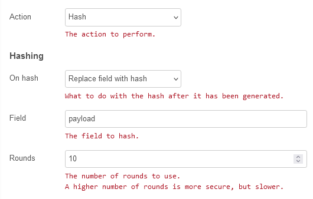
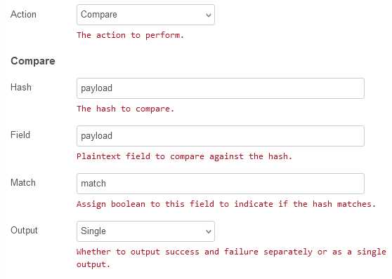

# node-red-contrib-bcrypt

https://flows.nodered.org/node/node-red-contrib-bcrypt

## Про bcrypt в JS

Бібліотека bcrypt - це інструмент для хешування паролів і забезпечення  безпеки при зберіганні паролів в базах даних або передачі через мережу.  Її головна мета - зберігання паролів у безпечному вигляді і запобігання  їхньої крадіжки або використання зловмисниками. Bcrypt використовує  потужні алгоритми хешування, що забезпечує надійний рівень захисту  паролів. Використання bcrypt рекомендується в багатьох веб-додатках та  системах управління паролями.

Наприклад, коли користувач реєструється на веб-сайті і вводить пароль, цей пароль передається у функцію `bcrypt.hash()` для хешування. Функція генерує випадкову сіль (salt) та використовує її разом з паролем для створення хеш-значення. Сіль унеможливлює використання табличних атак для підбору пароля.

При наступній авторизації користувача, введений пароль також хешується за допомогою `bcrypt.hash()`, а отримане хеш-значення порівнюється зі збереженим в базі даних хеш-значенням. Якщо хеш-значення збігається, то пароль вірний, і користувач отримує доступ до ресурсів.

Цей процес забезпечує високу безпеку паролів, оскільки хеш-функції є необоротними, тобто з хеш-значення не можна відновити вхідний пароль. Також, через використання солі, паролі з однаковим значенням будуть мати різні хеш-значення, що ускладнює атаки на паролі.

## Використання

Вузол, який можна використовувати для шифрування паролів користувачів. Функції:

- зашифрувати/хешувати
- перевірити

Використовує [bcrypt.js](https://github.com/dcodeIO/bcrypt.js)

- `field`: поле для шифрування або перевірки *(dot.notation)*    
- verify: поле для перевірки *(dot.notation)*

Зазначене поле буде замінено на зашифровану версію, якщо для дії встановлено шифрування. 

При виборі `Action=Hash` доступні насупні поля:

- `On hash`: `Replace filed with hash`  або `assign to another field`. Що робити з хешем після його створення. 
- `Rounds` Кількість раундів для використання. Більша кількість раундів безпечніша, але повільніша.

При виборі `Action=Cpmpare` доступні насупні поля:

- `Match`  - Призначте логічне значення цьому полю, щоб вказати, чи збігається хеш.
- `Output` - `sinle` або `separate` - Чи виводити успіх і невдачу окремо чи як один вихід.  