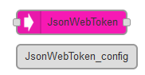
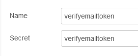

# Node-Red Auth Node (JSONWebToken)

https://flows.nodered.org/node/node-red-contrib-auth

Вузол node-red для автентифікації за допомогою JSONWebToken. Використовуйте цей вузол, щоб зберігати та отримувати захищені маркери з повідомлення. Про JSONWebToken ви можете дізнтися за  [посиланням](https://github.com/pupenasan/ProgIngContrSystems/blob/master/%D0%94%D0%BE%D0%B2%D1%96%D0%B4%D0%BD%D0%B8%D0%BA%D0%B8/secur/jwt.md)

Ця бібліотека читає та записує безпечні JSONWebTokens. Ці маркери можна використовувати для безпечного зберігання клієнтських маркерів для автентифікації та авторизації користувачів.

Цей вузол не виконує автентифікацію сам і може використовуватися з будь-яким вузлом повідомлень (тобто: `http`, `tcp`, `websocket` тощо).

## JSONWebToken_config

Secret - вмкористовується як вхідне значення для JSONWebToken, якщо він не вказується явно у вхідому повідомленні

## JSONWebToken

Вузол для захисту http-вузлів за допомогою веб-токена json. Вузол працює в дному з 2-х режимів:

- кодування маркеру відбувається у випадку, якщо присутнє значення `msg.payload` і відсутнє значення `msg.token`; цей вузол кодуватиме корисне навантаження повідомлення у веб-токен JSON за допомогою пакета jsonwebtoken і виводить початкове корисне навантаження на `msg.payload`, а маркер — на `msg.token`
- декодування маркеру відбувається якщо присутнє значення `msg.token`, цей вузол декодує веб-токен json за допомогою налаштованого ключа та виводить значення токена назад у `msg.token`

Секрет/ключ сеансу можна встановити, додавши `msg.secret` або налаштувавши вузол із секретом у вузлі конфігурації.

Наступні елементи в `msg.payload` змінять конфігурацію маркера:

- `exp` - замінює значення "expiresIn" значенням корисного навантаження.
- `nbf` - замінює значення "notBefore" значенням корисного навантаження.
- `aud` - замінює значення "audience" значенням корисного навантаження
- `sub` - замінює значення "subject" значенням корисного навантаження