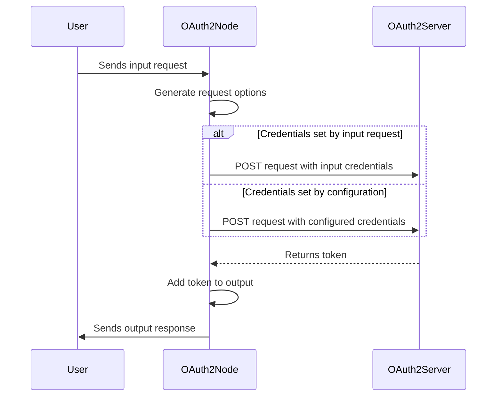
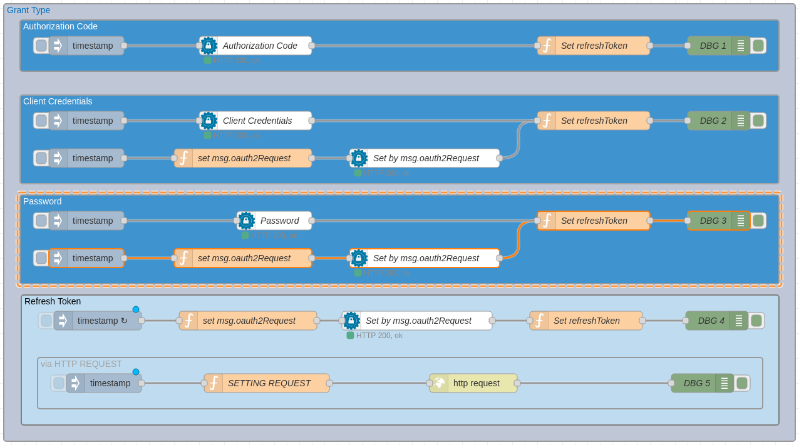

# node-red-contrib-oauth2

https://github.com/caputomarcos/node-red-contrib-oauth2

`node-red-contrib-oauth2` — це вузол Node-RED, який забезпечує потік автентифікації OAuth2. Цей вузол використовує протокол OAuth2 для отримання маркера доступу, який можна використовувати для виконання автентифікованих запитів API.



Ви можете встановити цей вузол безпосередньо з редактора Node-RED, перейшовши в меню «Керування палітрою» та ввівши пошуковий запит `node-red-contrib-oauth2`. Крім того, ви можете встановити його за допомогою npm:

```
$ cd ~/.node-red
$ npm install node-red-contrib-oauth2
```

Вузол вимагає URL-адресу маркера доступу та набір облікових даних клієнта для автентифікації за допомогою цієї URL-адреси. Вузол згенерує HTTP-запит до URL-адреси маркера доступу, щоб отримати маркер доступу за допомогою облікових даних клієнта. Маркер доступу може зберігатися у властивості повідомлення, яке можуть використовувати наступні вузли в потоці.

Вузол забезпечує два режими роботи:

1. Статичні облікові дані: облікові дані клієнта можна встановити на сторінці конфігурації вузла.
2. Динамічні облікові дані: облікові дані клієнта можна надіслати вузлу як частину корисного навантаження повідомлення.

## Приклад

[](https://user-images.githubusercontent.com/3945941/229128108-2e104b94-cd88-4e8e-be60-a746cefbf867.png)

Екпсорт потоку доуступний за посиланням https://github.com/caputomarcos/node-red-contrib-oauth2

У цьому прикладі використано [go-oauth2-server](https://github.com/RichardKnop/go-oauth2-server) , реалізований за допомогою GO (Golang). від [RichardKnop](https://github.com/RichardKnop)

## Входи

| Input                                     | Type    | Description                                                  |
| ----------------------------------------- | ------- | ------------------------------------------------------------ |
| container                                 | string  | This refers to the name of the container that is intended to receive the message object. By default, it is set to oauth2Response. |
| grant type                                | object  | This specifies the grant type used to obtain the access token. |
| access token url                          | string  | This is the URL used to obtain the access token.             |
| client id                                 | string  | This is the unique identifier for the client application.    |
| client secret                             | string  | This is the secret key used to authenticate the client application. |
| username                                  | string  | This is the username used for authentication. **Grant Type:** `password` |
| password                                  | string  | This is the password used for authentication. **Grant Type:** `password` |
| authorization endpoint                    | string  | This is the URL of the authorization endpoint. **Grant Type:** `authorization code` |
| code (read only)                          | string  | This is the authorization code. **Grant Type:** `authorization code` |
| scope                                     | string  | This specifies the scope of the access request.              |
| use proxy                                 | boolean | This specifies whether to use a proxy or not.                |
| Proxy Configuration                       | object  | This specifies the configuration for the proxy. **User Proxy:** `true` |
| only send non-2xx responses to catch node | boolean | This specifies whether to only catch non-2xx responses.      |
| embedded credentials                      | boolean | This specifies whether to include the client credentials in the token request body for authentication purposes. |
| reject Unauthorized                       | boolean | This specifies whether to reject unauthorized requests. The  rejectUnauthorized parameter controls SSL/TLS certificate validation for the server, with true enforcing validation and false disabling it. |

**`Note:`**

> - If running behind a proxy, the standard `http_proxy=...` environment variable should be set and `Node-RED restarted, or use Proxy Configuration`. If Proxy Configuration was set, the configuration take precedence over environment variable.

> - The OAuth redirect URL is set by default to `/oauth2/redirect`, which is the endpoint responsible for receiving the authorization `code`.

## Виходи

| Output        | Description                                                  |
| ------------- | ------------------------------------------------------------ |
| access_token  | This is the access token obtained from the OAuth2 server.    |
| expires_in    | This is the duration of time, in seconds, until the access token expires. |
| token_type    | This is the type of the token. For example, "Bearer".        |
| scope         | This specifies the scope of the access granted by the token obtained. |
| refresh_token | This is the refresh token that can be used to obtain a new access token before the current one expires. |

The `msg.oauth2Request` object contains the  OAuth2 request details that are set by the node. The following are the  different types of credentials that can be used for authentication:

### `Client Credentials`

The client credentials can be sent as part of the message payload to the node. The `msg.oauth2Request.credentials` object should contain the following properties:

- `grant_type` (string): This specifies the grant type. For dynamic credentials, the value should be set to "client_credentials".
- `client_id` (string): This is the client ID of the OAuth2 client.
- `client_secret` (string): This is the client secret of the OAuth2 client.
- `scope` (string): This specifies the scope of the access requested.

Here's an example:

```
msg.oauth2Request = { 
    "access_token_url": "http://localhost:8080/v1/oauth/tokens",
    "credentials": {
        "grant_type": "client_credentials",
        "client_id": "test_client_1",
        "client_secret": "test_secret",
        "scope": "read_write"
    },
};
return msg;
```

### `Password`

The username and password can be sent as part of the message payload to the node. The `msg.oauth2Request.credentials` object should contain the following properties:

- `grant_type` (string): This specifies the grant type. For password credentials, the value should be set to "password".
- `client_id` (string): This is the client ID of the OAuth2 client.
- `client_secret` (string): This is the client secret of the OAuth2 client.
- `scope` (string): This specifies the scope of the access requested.
- `username` (string): This is the username of the user.
- `password` (string): This is the password of the user.

Here's an example:

```
msg.oauth2Request = {
    "access_token_url": "http://localhost:8080/v1/oauth/tokens",
    "credentials": {
        "grant_type": "password",
        "client_id": "test_client_1",
        "client_secret": "test_secret",
        "scope": "read_write",
        "username": "test@user",
        "password": "test_password"
    },
};
return msg;
```

### 

### `refreshToken`

A refresh token can be used to obtain a new access token without requiring the user to re-authenticate. The `msg.oauth2Request.credentials` object should contain the following properties:

- `grant_type` (string): This specifies the grant type. For refresh token credentials, the value should be set to "refresh_token".
- `client_id` (string): This is the client ID of the OAuth2 client.
- `client_secret` (string): This is the client secret of the OAuth2 client.
- `scope` (string): This specifies the scope of the access requested.
- `refresh_token` (string): This is the refresh token obtained from a previous authentication.

Here's an example:

```
let refreshToken = global.get('refreshToken');

msg.oauth2Request = { 
    "access_token_url": "http://localhost:8080/v1/oauth/tokens",
    "credentials": {
        "grant_type": "refresh_token",
        "client_id": "test_client_1",
        "client_secret": "test_secret",
        "scope": "read_write",
        "refresh_token": refreshToken   
    },
};
return msg;
```

