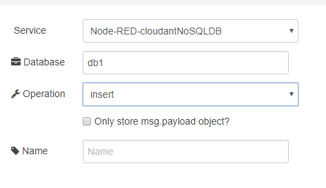

## cloudant out (зберегти в документ IBM Cloudant)

 Простий вузол виводу в Cloudant зберігає вхідне повідомлення **msg** у вказаній базі даних. Якщо виставлена опція «Only story msg.payload object», то зберігатиметься не все повідомлення, а тільки корисне навантаження (рис.12.2).

Якщо параметр `_id ` не вказаний, Cloudant генерує випадковий id і кожного разу буде вставлений новий документ. 

рис.12.2. Налаштування вузлу cloudant out

Якщо Ви хочете **оновити** існуючий документ, ви повинні вказати останні значення для `_id` та `_rev` у вашому об'єкті. Якщо вони не відповідають поточним значенням, що зберігаються в базі даних, ви отримаєте повідомлення про помилку конфлікту, тому переконайтеся, що ви використовуєте найновішу інформацію для документа.

Також можна видаляти документи з бази даних, надаючи значення `_id` та `_rev` і вибираючи опцію “**remove**” для вузла. Ви можете передавати ці значення в самому об'єкті msg або як об'єкт в `msg.payload`.

Ім’я бази даних повинно відповідати наступним правилам:

- Без пробілів
- Всі літери маленькі
- Перший символ не може бути     `_`

У вашому документі слід уникати полів верхнього рівня, які починаються з `_`, за винятками для `_id`, `_rev` та інших зарезервованих слів [CouchDB reserved words](https://wiki.apache.org/couchdb/HTTP_Document_API#Special_Fields).