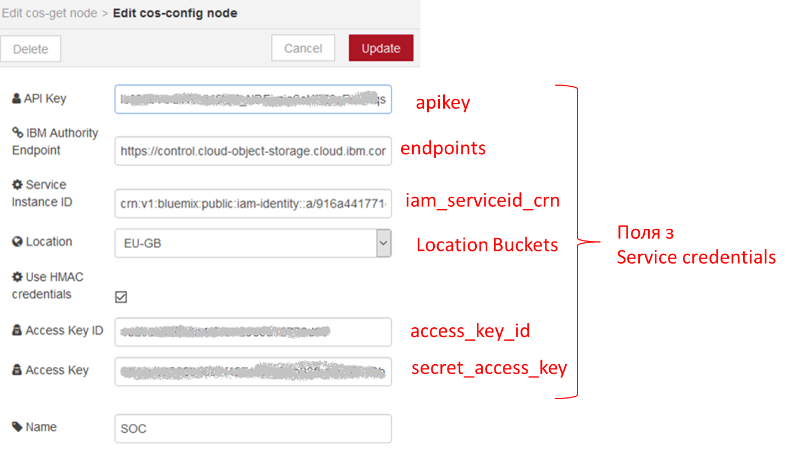

## cos config (конфігурування сховища IBM COS)

Конфігураційний вузол Cloud Object Storage налаштовується з використанням значень, які можна отримати з Service credentials для вашого екземпляра COS, який необхідно попередньо створити (рис.13.1). Приклад даний [за посиланням](http://edu.asu.in.ua/mod/book/view.php?id=126&chapterid=316).

рис.13.1.Налаштування вузлу cos config