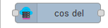
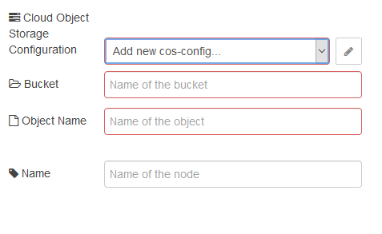

## cos del (видалення об’єкту з COS)

Цей вузол видаляє об’єкт з IBM Cloud. 

 рис.13.4. Налаштування вузлу cos del

Вузол має входи:

- `payload (string | buffer)` – корисне навантаження повідомлення що ініціює видалення 
- `bucket (string)` – існуючий bucket, в якому знаходиться об’єкт, що необхідно видалити.
- `objectname (string)`  – унікальне ім’я, що необхідно видалити.

Вузол повертає `msg.status` , якщо об’єкт видалено, або `msg.error` з помилкою, якщо не вдалося видалити. 