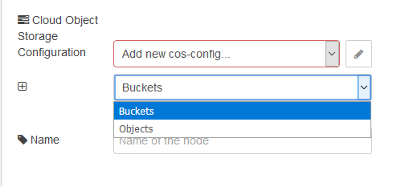

## cos qry (запит на отримання списку об’єктів COS)

 Цей вузол показує формує запит на отримання списку buckets або об’єктів в IBM Cloud (рис.13.5). 

**

рис.13.5.Налаштування вузла cos qry

Вузол має входи:

- `payload (string | buffer)` –     корисне навантаження повідомлення, що ініціює запит. 
- `list (string)` – вибір на     отримання списку всіх buckets або всіх об’єктів в bucket. 
- `bucket (string)` – існуючий bucket, з якого треба     отримати список об’єктів.

Вузол повертає `msg.payload` і ім’я об’єкту `msg.objectname` або `msg.error` з помилкою errorcode. 