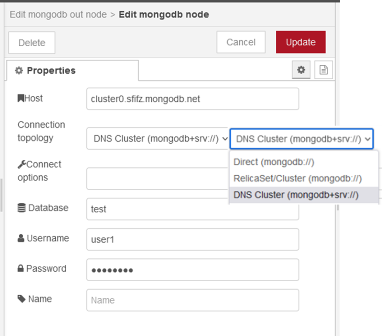
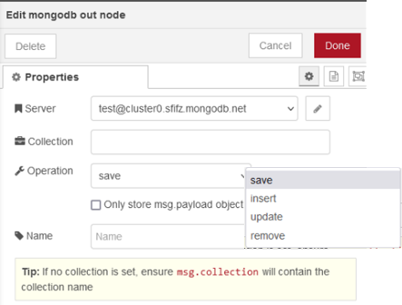

# mongodb

Означте метод підключення до екземпляра сервера MongoDB.



Підтримуються 3 варіанти:        

- Standard/direct            
- Standard/replicaset 
- Clustered by DNS seedlist

**Connect options** – це місце, де ви додаєте додаткові параметри, необхідні для вашого екземпляра MongoDB. Це може включати:

- `w=majorityreplica`
- `Set=replset`
- `authSource=admin`

та будь-які інші відповідні варіанти - повний комплект доступний за адресою  [Connection String URI Format — MongoDB Manual](https://docs.mongodb.com/manual/reference/connection-string/).   

Якщо ви підключаєтеся до [IBM Databases for MongoDB](https://cloud.ibm.com/catalog/services/databases-for-mongodb-group), як набір реплік, обов’язково додайте в **Connect options**   `ssl=true&tlsAllowInvalidCertificates=true `  .


## mongodb out

Простий вихідний вузол MongoDB. Може зберігати, вставляти, оновлювати та видаляти об’єкти з вибраної колекції.  



Оновлення змінює існуючий об’єкт чи об’єкти. Запит на вибір об’єктів для оновлення використовує `msg.query`, а оновлення елемента використовує `msg.payload`. Якщо `msg.query._id` є дійсним рядком mongo ObjectId, його буде перетворено на тип ObjectId.


Update can add a object if it does not exist or update multiple objects.    

Remove will remove objects that match the query passed in on `msg.payload`. A blank query will delete    *all of the objects* in the collection.    

You can either set the collection method in the node config or on `msg.collection`. Setting it in the    node will override `msg.collection`.    

By default MongoDB creates an *_id* property as the primary key - so repeated injections of the    same `msg` will result in many database entries.    

If this is NOT the desired behaviour - ie. you want repeated entries to overwrite, then you must set    the `msg._id` property to be a constant by the use of a previous function node.    

This could be a unique constant or you could create one based on some other msg property.    

Currently we do not limit or cap the collection size at all... this may well change.

## mongodb in

Викликає метод збирання MongoDB на основі вибраного оператора.


Знайдіть колекцію запитів за допомогою

- `msg.payload` як оператор запиту відповідно до функції `.find()`.
- опціонально: ви також можете (через функцію) встановити
   - `msg.projection` (object) для обмеження повернених полів,
   - `msg.sort` (object),
   - `msg.limit` (number)
   - `msg.skip` (number)

`Count` повертає підрахунок кількості документів у колекції або відповідності запиту, використовуючи `msg.payload` як оператор запиту.

`Aggregate` надає доступ до конвеєра агрегації за допомогою `msg.payload` як масиву конвеєра.

Ви можете встановити метод збору в конфігурації вузла або в `msg.collection`. Встановлення його у вузлі замінить `msg.collection`.

Перегляньте [*Документацію методів збирання MongoDB*](http://docs.mongodb.org/manual/reference/method/db.collection.find/) для прикладів.

Результат повертається в `msg.payload`.

### `find`

https://www.mongodb.com/docs/manual/reference/command/find/#mongodb-dbcommand-dbcmd.find

```js
db.runCommand(
   {
      find: <string>, //Назва колекції або представлення для запиту.
      filter: <document>, //опціонально - Предикат запиту. Якщо не вказано, всі документи в колекції відповідатимуть предикату.
      sort: <document>,//опціонально - Специфікація сортування для впорядкування результатів.
      projection: <document>, //Специфікація проекції, щоб визначити, які поля включити до повернених документів. Див. Проекція та оператори проекції.
      hint: <document or string>,
      skip: <int>,
      limit: <int>,
      batchSize: <int>,
      singleBatch: <bool>,
      comment: <any>,
      maxTimeMS: <int>,
      readConcern: <document>,
      max: <document>,
      min: <document>,
      returnKey: <bool>,
      showRecordId: <bool>,
      tailable: <bool>,
      oplogReplay: <bool>,
      noCursorTimeout: <bool>,
      awaitData: <bool>,
      allowPartialResults: <bool>,
      collation: <document>,
      allowDiskUse : <bool>,
      let: <document> // Added in MongoDB 5.0
   }
)
```

