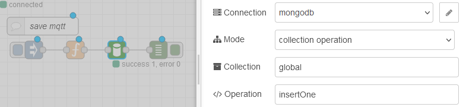

# MongoDB

# node-red-contrib-mongodb4

[node-red-contrib-mongodb4](https://github.com/steineey/node-red-contrib-mongodb4)        

Вузол MongoDB для Node-Red без обмежень.

Цей пакет містить два вузли для node-red:

**Вузол конфігурації**

Підключіться до локального сервера MongoDB або кластера MongoDB Atlas.

**Вузол потоку**

Виконайте операцію з базою даних або колекцією у своєму потоці. Цей вузол було розроблено для використання всіх функцій рідного драйвера MongoDB без будь-яких обмежень.


*Цей вузол був натхненний іншими проектами, як [node-red-contrib-mongodb3](https://github.com/ozomer/node-red-contrib-mongodb2) або [node-red-node-mongodb](https://flows.nodered.org/node/node-red-node-mongodb).*

## Встановлення

Перейдіть до свого каталогу .node-red - зазвичай `~/.node-red`.

```
npm install --save --omit=dev node-red-contrib-mongodb4
```

## Сумісність

Цей вузол MongoDB сумісний із такими версіями сервера MongoDB: 6.1, 6.0, 5.0, 4.4, 4.2, 4.0, 3.6

Node-RED >= v2.0.0,
NodeJS >= v14.20.1.

## Оновлення до версії пакета V2.x

Версія 2.x цього пакета тепер використовує драйвер mongodb версії 5.x.

Версії драйвера 5.x несумісні з Node.js версії 12 або ранішої. Якщо ви хочете використовувати цю версію драйвера, ви повинні використовувати Node.js версії 14.20.1 або новішої.

Оновлений драйвер припиняє підтримку допоміжних методів `Collection.insert()`, `Collection.update()` і `Collection.remove()`. У наведеному нижче списку наведено вказівки щодо заміни функціональних можливостей вилучених методів:

- Перехід із `Collection.insert()` на `insertOne()` або `insertMany()`
- Перехід із `Collection.update()` на `updateOne()` або `updateMany()`
- Перехід із `Collection.remove()` на `deleteOne()` або `deleteMany()`

 ## Приклад використання

Імпортуйте приклад потоку, щоб отримати короткий вступ, як використовувати цей вузол.
  [flow.json](https://raw.githubusercontent.com/steineey/node-red-contrib-mongodb4/master/examples/example-1.json)

[](https://raw.githubusercontent.com/steineey/node-red-contrib-mongodb4/master/examples/example-1-flow.png)

## Вузол конфігурації

Вузол конфігурації для конфігурації підключення MongoDB. Цей вузол створить клієнт MongoDB із пулом з’єднань для операційних вузлів.


### Simple Connection URI

- `Protocol` (string) : `mongodb` or `mongodb+srv`
- `Hostname` (string) : Hostname / IP to connect to MongoDB
- `Port` (number) : Optional port number. In most cases `27017`.

### Advanced Connection URI

- `URI` (string) : Визначте власний рядок підключення у форматі URI.[Read the docs: Connection String in URI Format](https://docs.mongodb.com/manual/reference/connection-string/)

### Authentication (optional)

- `Username` (string) : Username for authentication.
- `Password` (string) : Password for authentication.
- `AuthMech` (string) : Укажіть механізм автентифікації, який MongoDB використовуватиме для автентифікації підключення. Це використовуватиметься лише в поєднанні з іменем користувача та паролем.
- `AuthSource` (string) : Укажіть назву бази даних, пов’язану з обліковими даними користувача.

### Application

- `Database` (string) : Потрібна назва бази даних MongoDB.
- `Application Name` (string) : Назва програми, яка створила цей екземпляр MongoClient. MongoDB 3.4 і новіші версії друкуватимуть це значення в журналі сервера після встановлення кожного з’єднання. Він також записується в журнал повільних запитів і колекції профілів.

Якщо це поле не вказано, клієнтський вузол створить для вас назву програми. Це виглядає так: `nodered-azmr5z97`. Префікс `nodered` є статичним. `azmr5z97` — це випадковий ідентифікатор пулу з’єднань, створений під час запуску під час виконання, оновлення вузла конфігурації та повного розгортання. Ім’я поточної програми вузла конфігурації реєструється в журналі часу виконання node-red. Перевірте поточні підключення до бази даних за допомогою цього запиту:

```js
db.currentOp(true).inprog.reduce((accumulator, connection) => {
    const appName = connection.appName || "unknown";
    accumulator[appName] = (accumulator[appName] || 0) + 1;
    accumulator.totalCount ++;
    return accumulator;
  }, {totalCount: 0})
```

### TLS (optional)

- `TLS CA File` (path) : Specifies the location of a local  .pem file that contains the root certificate chain from the Certificate  Authority. This file is used to validate the certificate presented by  the mongod/mongos instance.
- `TLS Certificate Key File` (path) : Specifies the location of a local .pem file that contains either the client's TLS/SSL  certificate and key or only the client's TLS/SSL key when  tlsCertificateFile is used to provide the certificate.
- `TLS Certificate Key Filepassword` (string) : Specifies the password to de-crypt the TLS certificate.
- `TLS-Insecure` (bool) : Disables various certificate validations. THIS IS REALLY NOT SECURE.

### Connect Options

- `ConnectTimeoutMS` (integer) : Specifies the amount of  time, in milliseconds, to wait to establish a single TCP socket  connection to the server before raising an error.
- `SocketTimeoutMS` (integer) : To make sure that the driver correctly closes the socket in these cases, set the SocketTimeoutMS  option. When a MongoDB process times out, the driver will close the  socket. We recommend that you select a value for socketTimeoutMS that is two to three times as long as the expected duration of the slowest  operation that your application executes. If you set the value of ConnectTimeoutMS or  SocketTimeoutMS to 0, your application will use the operating system's  default socket timeout value.

- `MinPoolSize / MaxPoolsize` (integer) : Specifies the  minimun and maximum number of connections the driver should create in  its connection pool. This count includes connections in use.
- `MaxIdleTimeMS` (integer) : Specifies the amount of time,  in milliseconds, a connection can be idle before it's closed. Specifying 0 means no minimum.

### More Options

- `Options` (JSON) : MongoDB Driver 4 MongoClient supports more options. Feel free to overwrite all client options with your own. [Read the docs: MongoClientOptions](https://mongodb.github.io/node-mongodb-native/5.2/interfaces/MongoClientOptions.html)

### Connection Pools

Кожен вузол конфігурації має власний пул підключень із максимальним розміром пулу за замовчуванням 100 підключень за певний момент часу. Більше паралельних з’єднань/операцій буде поставлено в чергу та оброблено синхронно. У цьому сценарії повільні операції призведуть до затримки швидких операцій. Ви можете створити більше окремих пулів підключень із більшою кількістю вузлів конфігурації. [Додаткова інформація](https://docs.mongodb.com/drivers/node/current/faq/#how-can-i-prevent-a-slow-operation-from-delaying-other-operations-)

## Вузол потоку

Виконуйте операції collection MongoDB із цим вузлом.


### Inputs / Options

- `Connection` (mongodb-client) : Select a MongoDB database server connection.
- `Mode` | `msg.mode` (string) : Decide if you want to run a collection or db operation {'collection', 'db'}
- `Collection` | `msg.collection` (string) : MongoDB database collection.
- `Operation` | `msg.operation` (string) : Виконує операцію колекції або бази даних.  Звичайними є операції колекції  є `find`, `findOne`, `insertOne`, `insertMany`, `updateOne`, `updateMany`, `deleteOne`, `deleteMany`, `aggregate` та інші.  Операції `insert`, `update` and `delete` застаріли та не підтримуються останньою версією драйвера mongodb. Щоб дізнатися більше, прочитайте [інструкції з оновлення](https://github.com/steineey/node-red-contrib-mongodb4#upgrade-to-package-version-v2x). Поширеними операціями з базою даних є `command`, `ping`, `stats` тощо. 

- `msg.payload` (array) : Передайте аргументи операції CRUD як корисне навантаження повідомлення. Корисне навантаження повідомлень має бути типу масиву, щоб передати кілька аргументів функції в операцію драйвера.

Приклад `insertOne`:

```js
msg.payload = [{name: 'Anna', age: 1}];
```

Приклад `find`:

```js
// find query argument
const query = {
  age: 22
};
// find option argument
const options = {
  sort: {name: 1}, 
  projection: {name: 1},
  limit: 10,
  skip: 2
};
// payload for mongodb4 node
msg.payload = [query, options];
return msg;
```

Масив корисного навантаження буде передано як аргументи функції для операції збору драйверів MongoDB: `collection.find({age: 22}, {sort: {...}})`

Інший приклад виклику агрегації:

```js
// aggregation pipeline
const pipeline = [{
    $sort:{age: 1}
}, {
    $project: {
        name: 1
    }
},{
    $limit: 10
}];
// optional: aggregate options
const options = {
    allowDiskUse: true
};
// payload for mongodb4 node
msg.payload = [pipeline, options];
return msg;
```

У простому виклику агрегації у вас є масив усередині масиву, типу `msg.payload = [pipeline]`. Це може заплутати, але я не знайшов кращого рішення для цього.

- `Output` (string) : For `find` and `aggregate` operation. Choose `toArray` or `forEach` output type.

- `MaxTimeMS` (integer) : `MaxTimeMS` Означує максимальний проміжок часу, протягом якого сервер має чекати завершення операції після того, як вона досягне сервера. Якщо операція виконується понад указаний ліміт часу, вона повертає помилку очікування. Запобігайте уповільненню сервера довготривалими операціями, вказавши значення часу очікування. Вказівка 0 означає відсутність часу очікування.

- `Handle document _id` (bool) : Якщо цю функцію ввімкнено, вузол операції перетворить документ `document_id` типу string на документ `document_id` типу ObjectId.

Ідентифікатор документа MongoDB за умовчанням має бути типу ObjectId. Це означає, що рідний драйвер очікує таких аргументів запиту: `msg.payload = [{_id: ObjectId("624b527d08e23628e99eb963")}]`

Цей вузол mongodb може впоратися з цим за вас. Якщо рядок є дійсним ObjectId, його буде перетворено на справжній ObjectId перед виконанням рідним драйвером. Отже, це спрацює:  `msg.payload = [{_id: "624b527d08e23628e99eb963"}]` ...and this will also work: `msg.payload = [{_id: {$in: ["624b527d08e23628e99eb963"]}}]`

Додаткова інформація про операції з колекціями  [Collection-API v5.2](https://mongodb.github.io/node-mongodb-native/5.2/classes/Collection.html)

### Payload Output

Вузол виведе відповідь драйвера бази даних як корисне навантаження повідомлення. Операції `aggregate` і `find` можуть виводитися за допомогою `toArray` або `forEach`.

### Додаткова інформація

[Visit the MongoDB Driver Docs](https://docs.mongodb.com/drivers/node/current/)

## Методи Collections

https://mongodb.github.io/node-mongodb-native/5.2/classes/Collection.html

### InsertOne



Зверніть увагу що назву методу `InsertOne` треба писати з маленької літери 

```js
msg.payload = [{name: 'marina', age: 22}];
```

### findOne

```js
msg.payload = [{ _id: 'mqtt' }];
```


## DB