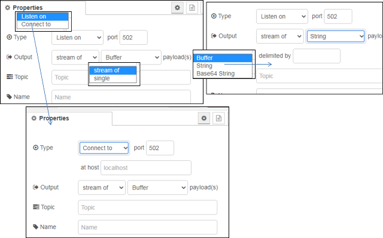

[<- На головну](../)  [Розділ](README.md)

## TCP in 

 Забезпечує отримання вхідних даних з порта TCP.

Можна або підключитися до віддаленого порту TCP (`Type = Connect To`), або прийняти вхідні з'єднання (`Type = Liasten On`).

**Примітка.** У деяких системах вам може знадобитися root або адміністратор для доступу до портів нижче 1024.

При підключенні до віддаленого порту вузол для цього підключення буде тільки приймати вхідні повідомлення. При необхідності підключення в режимі запит/відповідь варто використовувати вузол [TCP request](tcp-request.md) 