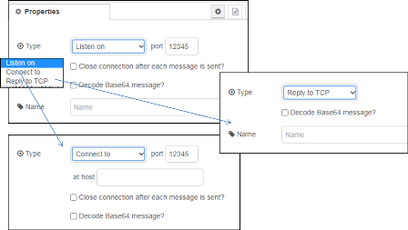

[<- На головну](../)  [Розділ](README.md)

## TCP out

Забезпечує відправлення вихідного повідомлення на TCP-порт. 

Можна або підключитися до віддаленого порту TCP (`Type=Connect to`), приймати вхідні з'єднання (`Type=Listen on`) або відповідати на повідомлення, отримані від вузла TCP In (`Type=Reply to TCP`).

Надсилається лише `msg.payload`.

Якщо  `msg.payload` - рядок, що містить кодування бінарних даних Base64, опція `decode Base64` призведе до того, що вона буде перетворена назад у двійкові дані перед відправкою.

Якщо `msg._session` немає, корисне навантаження надсилається **всім** підключеним клієнтам.

**Примітка.** У деяких системах вам може знадобитися root або адміністратор для доступу до портів нижче 1024.

При підключенні до віддаленого порту вузол для цього підключення буде тільки відправляти вихідні повідомлення. При необхідності підключення в режимі запит/відповідь варто використовувати вузол [TCP request](tcp-request.md) 