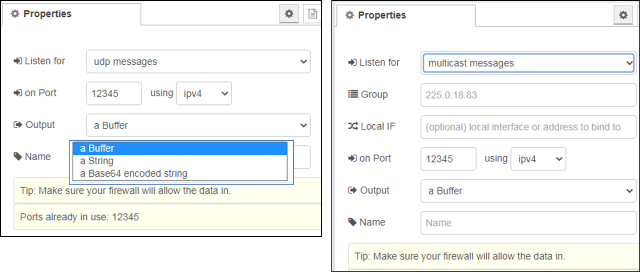

[<- На головну](../)  [Розділ](README.md)

## UDP in

Вузол введення UDP, який виробляє `msg.payload`, що містить буфер, рядок або base64-кодований рядок. Підтримується багатоадресне отримування.

Він також забезпечує передачу `msg.ip` та ` msg.port`, встановлені на ip-адресу та порт, з якого було отримано повідомлення.

**Примітка**: У деяких системах вам може знадобитися root або адміністраторський доступ для використання портів нижче 1024 та/або широкомовлення.