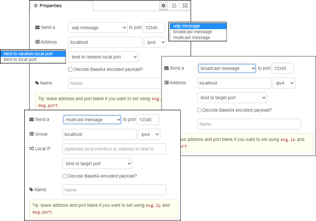

[<- На головну](../)  [Розділ](README.md)

## UDP out 

Цей вузол відправляє `msg.payload` на призначений хост і порт UDP. 

Підтримується багатоадресна передача.

Ви також можете використовувати `msg.ip` і ` msg.port` для встановлення значень призначення, але статично налаштовані значення мають перевагу.

Якщо ви вибрали широкомовлення (broadcast), то встановіть адресу на ip адресу локального мовлення, або, можливо, спробуйте 255.255.255.255, яка є глобальною адресою широкомовної передачі.

**Примітка**: У деяких системах вам може знадобитися мати root, щоб використовувати порти нижче 1024 та/або широкомолвення.