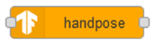

# node-red-contrib-tensorflow

https://flows.nodered.org/node/node-red-contrib-tensorflow

https://www.linux.com/news/using-tensorflow-js-and-node-red-with-image-recognition-applications/

## TensorFlow Models

- [Object Detection](https://github.com/tensorflow/tfjs-models/tree/master/coco-ssd) -- The node to identify objects in an image
- [MediaPipe Handpose](https://github.com/tensorflow/tfjs-models/tree/master/handpose) -- The node to detect fingers in a hand
- [MobileNet](https://github.com/tensorflow/tfjs-models/tree/master/mobilenet) -- The node to classify images with MobileNet
- [PoseNet Model](https://github.com/tensorflow/tfjs-models/tree/master/posenet) -- The node to estimate human pose

## cocossd

Вузол для ідентифікації об’єктів на зображенні. Цей вузол може обробляти дані буфера у форматі даних PNG або JPEG. Вузли `file-out`, `http-request` (buffer output), `file-inject`  і [`camera node`](https://flows.nodered.org/node/node-red-contrib-browser-utils)  - корисні для передати дані буфера цьому вузлу. Після обробки даних зображення цей вузол виводить результат у `msg.payload`. Водночас він генерує анотовані дані зображення в `msg.annotatedInput` як буфер формату PNG. Щоб показати анотоване зображення в редакторі потоку Node-RED, корисно використовувати [image-preview node](https://flows.nodered.org/node/node-red-contrib-image-output).

[Object Detection](https://github.com/tensorflow/tfjs-models/tree/master/coco-ssd) - GitHub repository of Object Detection (coco-ssd)

**Inputs**

- payload (buffer) - A buffer of PNG or JPEG data

**Outputs**

- payload (string) - The result string from the processing
- details (object) - The details of the result returned from TensorFlow.js
- annotatedInput (buffer) - The annotated image data

## handpose

Вузол для визначення пальців на руці. Цей вузол може обробляти дані буфера у форматі даних PNG або JPEG. Вузли `file-out`, `http-request` (buffer output), `file-inject`  і [`camera node`](https://flows.nodered.org/node/node-red-contrib-browser-utils)  - корисні для передати дані буфера цьому вузлу. After processing the image data, this node outputs the result to `msg.payload`. At the same time, it generates the annotated image data in `msg.annotatedInput` as a PNG format buffer. To show the annotated image on Node-RED flow editor, the [image-preview node](https://flows.nodered.org/node/node-red-contrib-image-output) is useful.

[MediaPipe Handpose](https://github.com/tensorflow/tfjs-models/tree/master/handpose) - GitHub repository of MediaPipe Handpose

**Inputs**

- payload (buffer) A buffer of PNG or JPEG data

**Outputs**

- payload (string) The result string from the processing
- details (object) The details of the result returned from TensorFlow.js

## mobilenet

Вузол для класифікації зображень за допомогою MobileNet. Цей вузол може обробляти дані буфера у форматі даних PNG або JPEG. Вузли `file-out`, `http-request` (buffer output), `file-inject`  і [`camera node`](https://flows.nodered.org/node/node-red-contrib-browser-utils)  - корисні для передати дані буфера цьому вузлу. After processing the image data, this node outputs the result to `msg.payload`. To show the annotated image on Node-RED flow editor, the [image-preview node](https://flows.nodered.org/node/node-red-contrib-image-output) is useful.

[MobileNet](https://github.com/tensorflow/tfjs-models/tree/master/mobilenet) - GitHub repository of MobileNet

**Inputs**

- payload (buffer) - A buffer of PNG or JPEG data

**Outputs**

- payload (string) - The result string from the processing
- details (object) - The details of the result returned from TensorFlow.js

## posenet

Вузол для оцінки пози людини. Цей вузол може обробляти дані буфера у форматі даних PNG або JPEG.  Вузли `file-out`, `http-request` (buffer output), `file-inject`  і [`camera node`](https://flows.nodered.org/node/node-red-contrib-browser-utils)  - корисні для передати дані буфера цьому вузлу. After processing the image data, this node outputs the result to `msg.payload`. At the same time, it generates the annotated image data in `msg.annotatedInput` as a PNG format buffer. To show the annotated image on Node-RED flow editor, the [image-preview node](https://flows.nodered.org/node/node-red-contrib-image-output) is useful.

- [PoseNet](https://github.com/tensorflow/tfjs-models/tree/master/posenet) - GitHub repository of PoseNet

**Inputs**

- payload (buffer) - A buffer of PNG or JPEG data

**Outputs**

- payload (string) - The result string from the processing
- details (object) - The details of the result returned from TensorFlow.js
- annotatedInput (buffer) - The annotated image data