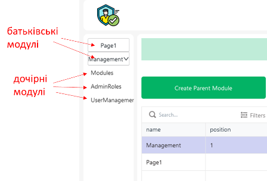
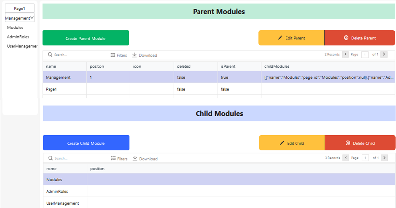
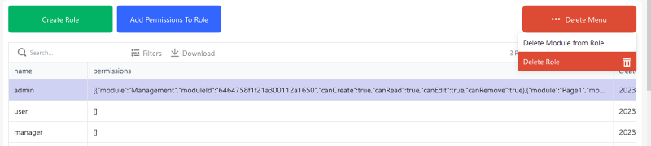
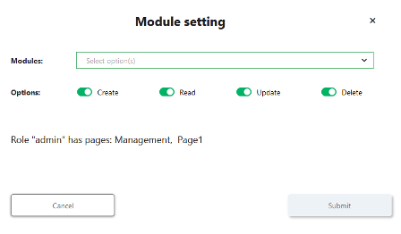
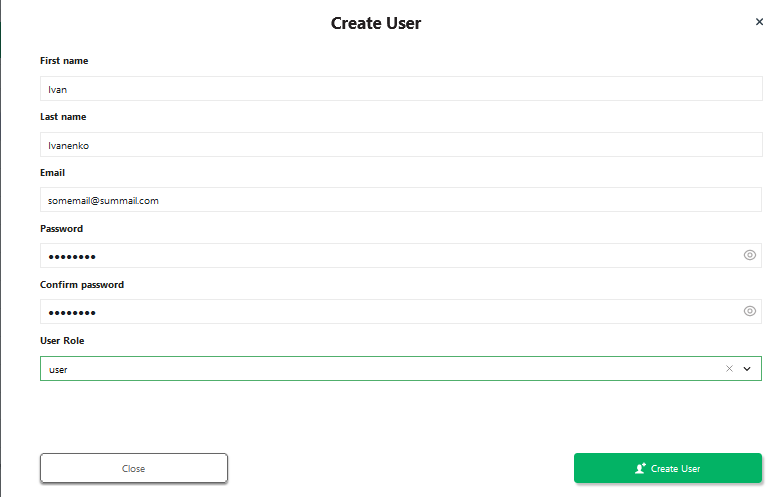
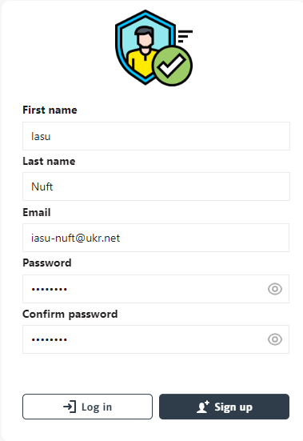
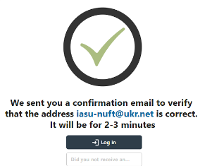
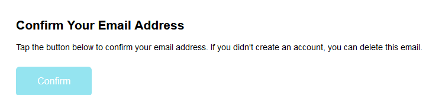
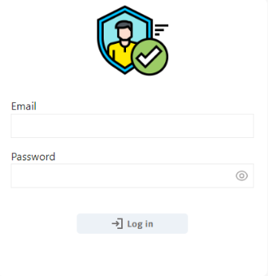

[На головну](../../README.md)

# Авторизаційний шаблон для застосунків на базі LoCode платформи UBOS

У даному розділі описується шаблон для [платформи UBOS](https://ubos.tech/) який дає вам можливість швидко почати розробляти застосунки, що потребують автентифікації користувача (перевірка автентичності) та його авторизації (дозволи в системі).

Порядок створення такого застосунку описано в [даній статті](https://community.ubos.tech/olha/nalashtuvannia-avtorizatsiinogho-tiemplieitu-27la) від [Olha Mashtaler](https://community.ubos.tech/olha). Тут ми зупинимося на послідовному розкриванні принципів та організації роботи шаблону починаючи від бачення з точки зору користувача до аналізу коду кінцевої реалізації. Слід звернути увагу що на момент прочитання даного розділу, реалізація може бути вдосконаленою і мати інший код. Даний розділ може стати корисним як розробникам на базі [платформи UBOS](https://ubos.tech/) так і розробникам в [Node-RED](https://nodered.org/) та [Appsmith](https://www.appsmith.com/) які становлять основу платформи.

## Загальні підходи до організації автентифікації та авторизації

Модуль передбачає організацію автентифікації користувачів на базі логіна (адреса електронної пошти) і пароля та надання їм доступу до дозволених сторінок користувацького інтерфейсу (UI, User Interface). Для початку варто зупинитися на організації такого доступу з точки зору використання застосунку. У цій частині ми не будемо розглядати як функціонує шаблон, а більше як ним користуватися адміністраторам та користувачам.  

Користувацький інтерфейс розроблений на базі сторінок (page). Користувачу (**user**) надається доступ до кожної сторінки, та до її елементів, в залежності від того, до якої групи користувачів він належить. Для групування користувачів  використовується рольова ієрархія. **Роль (role)** в даному шаблоні - це група користувачів, які мають однакові права щодо доступу до певних сторінок. Таким чином, усі користувачі які мають однакові ролі мають доступ до тих самих сторінок, і тих самих ементів на них. Розмежування доступу до контенту в межах сторінок в залежності від конкретного користувача не входить в даний шаблон, але він дає основу для такої реалізації і буде описаний в окремому розділі або статті.

Є особлива адміністраторська роль, яка має привілейований доступ, а саме до адміністративних сторінок. Особливість також в тому, що ця роль так як і перший користувач з цією роллю створюється в режимі розроблення а не функціонування розгорнутого застосунку. Тому напочатку адміністратор системи є розробником розгорнутого застосунку, хоча пізніше цього користувача можна буде видалити.  

## Сторінки шаблону

Сторінки інтерфейсу можуть бути доступним всім, або конкретній ролі. За замовченням в профілі налаштовані наступні сторінки з шаблону:

- Login - сторінка входу в систему користувача
- Registration - самостійна реєстрація користувача, тобто для створення нового користувача
- Info - сторінка повідомлення про відправлення на пошту запиту на підтвердження пошти
- Registered - сторінка повідомлення про про відправлення на пошту запиту на підтвердження пошти
- queryToResetPassword - сторінка запиту на скидання паролю
- ResetPassword - сторінка створення нового паролю при запиті на скидання паролю
- PasswordChanged - сторінка про успішне скидання паролю

При створенні профілю адміністратора йому необхідно надати доступ до таких сторінок шаблону: 

- Modules - сторінка для створення та редагування модулів, що означують доступ до сторінок  
- AdminRoles - сторінка для створення та редагування ролей та надання їм дозволів на доступ до модулів
- UserManagement - сторінка для створення та редагування користувачів 

## Модулі 

**Модуль (Module)** - це посилання на сторінку або групу сторінок. Модулі організовують двухрівневе меню: перший рівень - батьківські модулі, другий - дочірні (рис.1). Таким чином модулі можна вважати пунктами меню, а організація доступу до сторінок зводиться до організації меню сторінок для кожного користувача. Так наприклад у адміністратора системи меню має принаймні один батьківський модуль, куди включені три дочірні модулі - сторінки адміністрування.

 

рис.1. Організація меню через модулі

Батьківські модулі можуть бути посиланнями на сторінку або вміщувати дочірні модулі (вкладені пункти меню). Дочірні модулі - є посиланнями на сторінки. У плинній версії шаблону назва модулю що посилається на сторінку має співпадати з назвою сторінки в редакторі. Також є обмеження щодо назви сторінок, вони не повинні бути кирилицею та містити пробіли.

Модулі налаштовуються на сторінці шаблону Modules (рис.2), який доступний тільки користувачам з адміністративною роллю. Там можна створювати та редагувати модулі та організовувати порядок відображення їх в меню.  

 

рис.2. Сторінка Modules 

## Ролі

Як вже зазначалося, роль - це група користувачів, яким надаються однакові права щодо доступу до сторінок. Ролі створюються та редагуються на сторінці AdminRoles (рис.3). Так у ролі "Admin" є доступ до батьківського модуля `Management`, який включає три дочірні модулі доступу до адміністративних сторінок. 

рис.3. Сторінка AdminRoles   

На сторінці AdminRoles кожній ролі можна надати певні дозволи `Permissions`,  до модулів з вказаними опціями (рис.4). Обмеження по опціям не є частиною шаблону їх можна реалізовувати розробнику самостійно.

рис.4. Надання дозволів ролям (`Add Permissions To Role`)

## Керування користувачами

Користувачі можуть реєструватися самі в системі, або створюватися адміністратором. У будь якому випадку усіх користувачів та їх налаштування (окрім паролю) видно на адміністративній сторінці UserManagement (рис.5).  

рис.5. Сторінка UserManagement

На цій сторінці також можна видаляти існуючих або добавляти нових користувачів. Варто зауважити, що видалені користувачі по факту не видаляються з бази даних, вони помічаються як видалені.  Натиснувши "Create User" адміністратор системи може добавляти користувача та надавати йому усі необхідні налаштування (рис.6)

рис.6. Сторінка створення користувача

## Самостійна реєстрація користувача

Користувач що бажає зареєструватися повинен зайти на сторінку "Registration" заповнити свої дані та натиснути "Signup".

рис.7. Сторінка самостійної реєстрації користувача користувача

Після цього висвітиться інформаційна сторінка (рис.8) а на пошту буде відправлено листа (рис.9). 

рис.8. Інформаційна сторінка про відправлення на пошту листа для підтвердження пошти. 

рис.9. Лист на пошті.

Натиснення "Confirm" підтвердить справжність пошти і користувачу буде запропоновано зайти в систему через сторінку входу (рис.10). 

рис.10. Сторінка входу користувача.

## Що далі?

У цій частині розділу ми розглянули функціонування авторизаційного модуля з точки зору користувачів. Далі розглянемо реалізацію модуля в серверній та клієнтській частині. 

Далі буде.