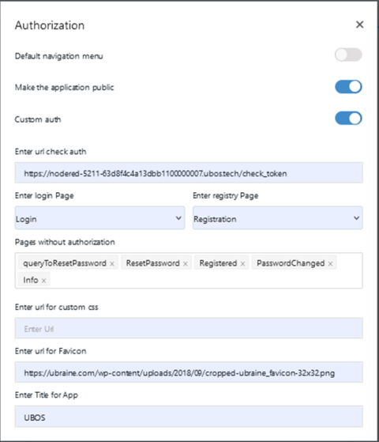

# Загальні налаштування UI

- Default navigation menu
- Make application public
- Custom auth:
  - Enter url check auth
  - Enter login Page
  - Enter registry Page
  - Pages withou authorization
  - Enter url for custom css
  - Enter Title for App

Код доступу(Access token) ми зберігаємо в cookie під назвою user_name. Він скаладається з ID, та імейлу користувача.

В налаштуванях, нашого проєкту(де ми писали шлях до check_token),  вказані сторінки до яких користувач має доступ без авторизації.
 Якщо спробувати зайти на сторіку, на яку користувач має зайти, будучи  авторизованим його автоматично перенаправить на сторінку Логін, бо він  має відсутній токен.

Якщо токену не має, то завжди буде перенаправляти на сторінку Логін.
 Токен створюється коли користувач заходить в систему. Далі, при кожному  переході між сторінками, буде перевірятись, чи час токекну не минув.  Якщо минув, то користувача розлогінить.