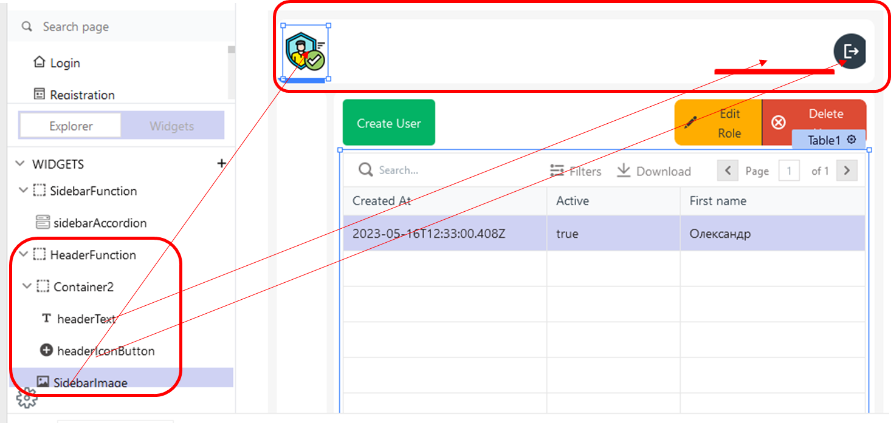
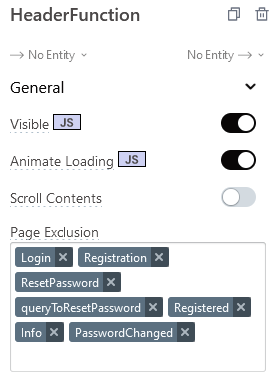

# HeaderFunction






## headerText

Відобаражає зареєстрованого в системі користувача 

Text

```js
{{appsmith.user.auth_module.user.info.user.email}}
```

## headerIconButton

Кнопка розлогінювання

```js
{{navigateTo('Login', {})}}
```

