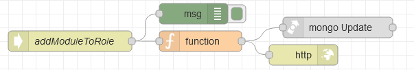

# Потік `POST /addModuleToRole`

Обробляє запит на створення ролі зі сторінки [AdminRoles](page_adminroles.md) (ModalAddModule)

```json
{
	"_id":"{{roles_table.selectedRow._id}}",
	"moduleValue": {{modules_field.selectedOptionValues}},// перелік модулів 
	"moduleName": {{modules_field.selectedOptionLabels}},// перелік модулів 
	"options": {{options_switch.selectedValues}}
}
```

Body



## function

```js
msg.collection = "admin_roles";

// дозволи
let crud = {
    "canCreate": false,
    "canRead": false,
    "canEdit": false,
    "canRemove": false
}
msg.payload.options.map(e => {
    if (e == "C") {
        crud.canCreate = true
    }
    else if (e == "R") {
        crud.canRead = true
    }
    else if (e == "U") {
        crud.canEdit = true
    } else if (e == "D") {
        crud.canRemove = true
    }
})


let modules = msg.payload.moduleName.map((name, index)=> {
    return {
        "name": name,
        "value": msg.payload.moduleValue[index]
    }

})

let preparedModules
 = modules.map(item => {
    return{
        module: item.name,
        moduleId: objectid(item.value),
        ...crud
    }
})

msg.query={
    "_id":objectid(msg.payload._id)
}

msg.payload={
    $push: {
        permissions: {
            $each: [...preparedModules]
        }
    }
}

return msg;
```

## mogo Update