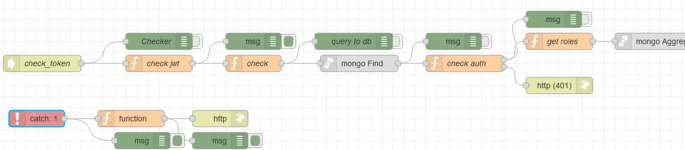

# Потік `POST /check_token`

До даної кінцевої точки йде звернення при перемиканні на усі сторінки, окрім тих, що задані в `Pages withou authorization`, деталі налаштування описані [Загальні налаштування UI](app_cfg.md)


**check_token**
 check_token - це флов, який декодить наш token, та повертає інформацію  на його основі. Цю інформацію можно побачити, коли робимо якийсь  редірект, то в панелі розробника в розділі Network, буде запит, який  називаєтьтся me, там в response ми зможемо побачити всю інформацію про  користувавча.

check_token будує наше меню, яке ми бачимо в бічній панелі. Він  отримує роль користувача(кожна роль говорить, до яких сторінок можна  мати доступ, та що саме на них робити). На основі цієї інформації він  створює об'єкт з доступними сторінками, які повертає цей запит. А віджет Акрдеон(який відображає меню), чекає коли прийде ця відповідь щоб  відобразити сторінки.




## check jwt

```js
msg.check = msg.payload;
const decoded = jwt.verify(msg.payload.token, 'test');
msg.payload = decoded

return msg;
```

## cath g

Обробник виключень для `check jwt`

###  show err Unautorizate

```js
msg.payload = {
    auth: "Unautorizate",
    code: 401,
    login_id: msg.check.login_id,
    app_id: msg.check.app_id
}
return msg;
```


## check

## mongo find

## check auth

## get roles

## mongo agregate

## menu grouping

## check user permissions

## cath 1

### function

