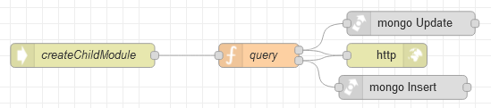

# Потік `POST /createChildModule`

Створення дочірнього модуля з вказаною назвою у вказаному батьківському модулі у вказаній позиції зі сторінки [Modules](page_modules.md)

```json
{
	"childModule":"{{childModule_field.selectedOptionValue}}",
	"parentModule":"{{TableParent.selectedRow._id}}",
	"position":{{positionChild.text}}
}
```



## query

```js
msg.collection = "admin_modules";

//якщо вказаний батьківський модуль
if (msg.payload.parentModule) {
    msg.query={
        "_id": objectid(msg.payload.parentModule)
    };

    msg.payload = {
        $addToSet: { //Додає елементи до масиву, лише якщо вони ще не існують у наборі.
            // цей елемент буде додано до масиву childModules
            childModules: {
                name: msg.payload.childModule,
                page_id: msg.payload.childModule,
                position: msg.payload.position
            }
        },
        $set: { //тепер він тсає батьківським
            isParent: true
        }
    }

    return [msg,]; //на Update

//якщо не вказаний батьківський модуль
} else {
        
    msg.payload={
        ...msg.payload,
        deleted: false,
        isParent: false
    }
    return [,msg]; //на Insert
}
```

