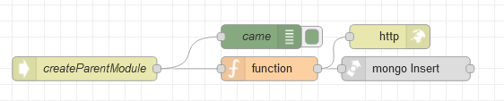

# Потік `POST /createParentModule`

Створює батьківський модуль з вказаним іменем та позицією в меню. Створюється зі сторінки [Modules](page_modules.md)

```json
{
	"name": "{{name_field.text}}",
	"position": {{position_field.text}},
	"icon": "{{icon_field.text}}"
}
```



## function

```js
msg.collection = "admin_modules"

msg.payload = {
    ...msg.payload,
    deleted: false,
    isParent: false
};

return msg;
```

