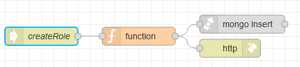

# Потік `POST /createRole`	

Обробляє запит на створення ролі зі сторінки [AdminRoles](page_adminroles.md) (ModalCreateRole)

Body

```json
{
		"name":"{{role_name_field.text}}"
}
```



## function

```js
msg.collection = "admin_roles";

msg.payload={
    name:msg.payload.name,
    deleted:false,
    permissions: [],
    createdAt: new Date(
        (new Date().
         toISOString()
        ))
}

return msg;
```

## mongo insert

Operation: Insert

Вставляє в `collection=admin_roles` роль з іменем `msg.payload.name`.