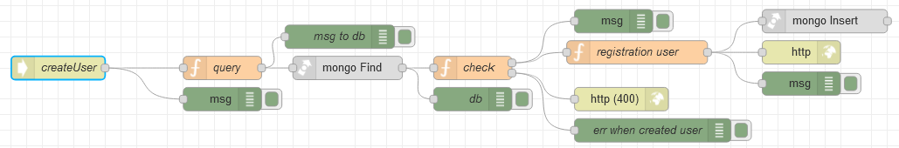

# Потік `POST /createUser`

Створює користувача за вказаним іменем, прізвищем, поштою, роллю та пароллю. Використовується на сторінці [User Management](page_usermanagement.md)

```json
{
	"firstname": "{{firstname_field.text}}",
	"lastname": "{{lastname_field.text}}",
	"email": "{{email_field.text}}",
	"password": "{{pass_field.text}}",
	"role": "{{field_add_user_role.selectedOptionValue}}"
}
```




## query

```js
msg.collection = "admins";
msg.oldpayload = msg.payload;

msg.payload = {
    email: msg.payload.email,
    deleted: false
};

return msg;
```

## check

```js
if (msg.payload.length > 0) {
    msg.payload = {
        data: "This email address already exists",
        code: 400,
    }
    return [null, msg]
}
else{
    return [msg, null]
}
```

## registration user

```js
let randomColor = "#" + Math.floor(Math.random() * 16777215).toString(16);
let encryptedPassword = await bcrypt.hash(msg.oldpayload.password, 10);

msg.payload = {
    "_id": objectid(),
    "deleted": false,
    "avatarColor": randomColor,
    "createdAt": new Date(),
    "roles": [objectid(msg.oldpayload.role)],
    "active": true,
    "firstname": msg.oldpayload.firstname,
    "lastname": msg.oldpayload.lastname,
    "email": msg.oldpayload.email,
    "password": encryptedPassword,
    verifyToken: null,
    resetPassToken: "",
    resetPassExpireToken: null
}

return msg;


// let randomColor = "#" + Math.floor(Math.random() * 16777215).toString(16);
// let encryptedPassword = await bcrypt.hash(msg.oldpayload.password, 10);
// const verifyToken = await jwt.sign(
//     { id: Math.round(Math.random()) },
//     "test",
//     {
//         expiresIn: "150m",
//     }
// );

// msg.cookies = {};
// msg.cookies["verify_token"] = verifyToken;
// msg.cookies["email_register"] = msg.oldpayload.email;

// msg.payload = {
//     "_id": objectid(),
//     "deleted": false,
//     "avatarColor": randomColor,
//     "createdAt": new Date(),
//     "roles": [objectid("634fe97d28c82b00103cd25d")],
//     "active": false,
//     "firstname": msg.oldpayload.firstname,
//     "lastname": msg.oldpayload.lastname,
//     "email": msg.oldpayload.email,
//     "password": encryptedPassword,
//     verifyToken,
//     resetPassToken: "",
//     resetPassExpireToken: null
// }

// return msg;
```

