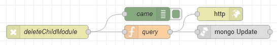

# Потік `DELETE /deleteChildModule`

Видаляє дочірній модуль з батьківського модулю. Проводиться на сторінці [Modules](page_modules.md).

```json
{
	"_id":"{{TableParent.selectedRow._id}}",
	"childModule_id":"{{TableChild.selectedRow.name}}"
}
```



## query

```js
msg.collection="admin_modules";

msg.query = {
    "_id": objectid(msg.payload._id)
};

msg.payload = {
    $pull: {
        "childModules": {
            "name": msg.payload.childModule_id
        }
    }
}
return msg;
```

